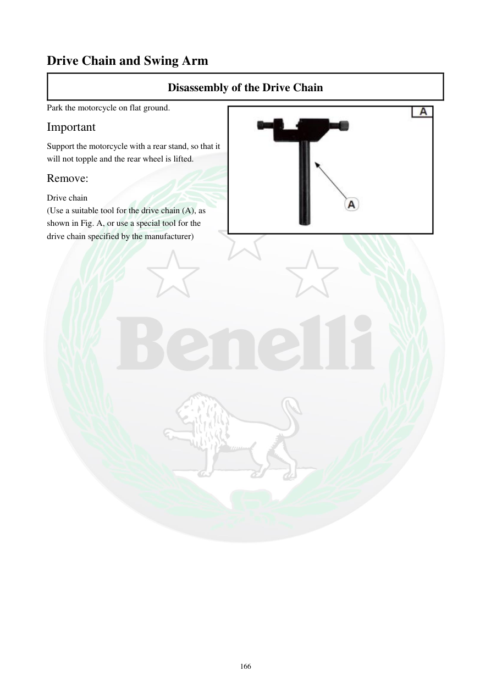

# Manual page 167

> Source: [page-0167.md](../source/page-0167.md)

## Page image / diagram

- [page-0167-img-01.jpeg](../images/embedded/page-0167-img-01.jpeg)

## Extracted text

# Source page 167

 
166 
Drive Chain and Swing Arm  
Disassembly of the Drive Chain 
Park the motorcycle on flat ground. 
Important  
Support the motorcycle with a rear stand, so that it 
will not topple and the rear wheel is lifted. 
Remove: 
Drive chain 
(Use a suitable tool for the drive chain (A), as 
shown in Fig. A, or use a special tool for the 
drive chain specified by the manufacturer)

## Persian notes

### بازکردن زنجیر انتقال
- موتورسیکلت را روی سطح صاف قرار داده و با پایه عقب مهار کنید تا چرخ عقب از زمین بلند باشد.
- زنجیر انتقال با ابزار مناسب مخصوص زنجیر یا ابزار ویژه توصیه‌شده توسط سازنده جدا می‌شود.
- برای ترتیب دقیق استفاده از ابزار، تصویر صفحه مرجع است.
