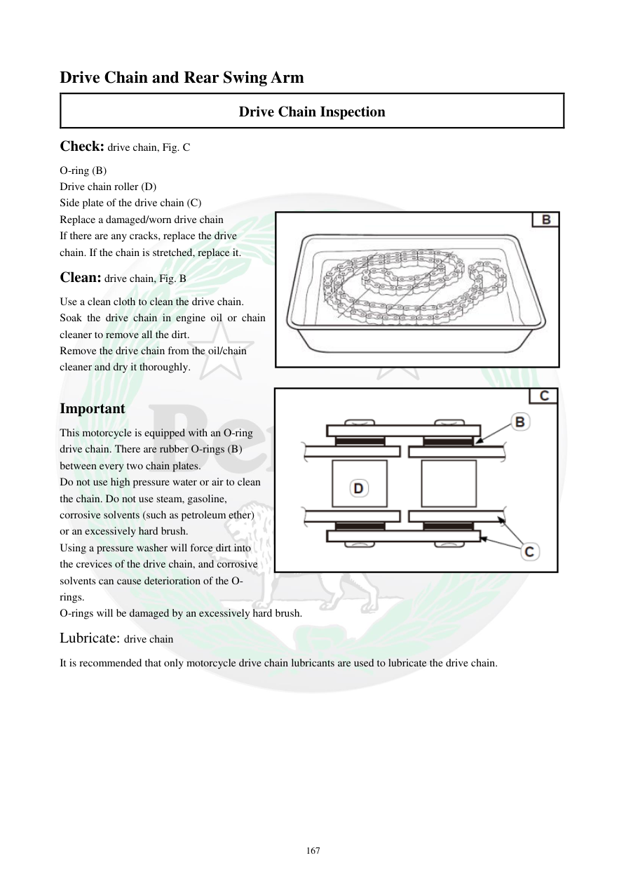

# Manual page 168

> Source: [page-0168.md](../source/page-0168.md)

## Page image / diagram

- [page-0168-img-01.jpeg](../images/embedded/page-0168-img-01.jpeg)

- [page-0168-img-02.png](../images/embedded/page-0168-img-02.png)

## Extracted text

# Source page 168

 
167 
Drive Chain and Rear Swing Arm 
Drive Chain Inspection 
Check: drive chain, Fig. C 
O-ring (B) 
Drive chain roller (D) 
Side plate of the drive chain (C) 
Replace a damaged/worn drive chain 
If there are any cracks, replace the drive 
chain. If the chain is stretched, replace it. 
Clean: drive chain, Fig. B 
Use a clean cloth to clean the drive chain. 
Soak the drive chain in engine oil or chain 
cleaner to remove all the dirt. 
Remove the drive chain from the oil/chain 
cleaner and dry it thoroughly. 
 
Important 
This motorcycle is equipped with an O-ring 
drive chain. There are rubber O-rings (B) 
between every two chain plates. 
Do not use high pressure water or air to clean 
the chain. Do not use steam, gasoline, 
corrosive solvents (such as petroleum ether) 
or an excessively hard brush. 
Using a pressure washer will force dirt into 
the crevices of the drive chain, and corrosive 
solvents can cause deterioration of the O-
rings. 
O-rings will be damaged by an excessively hard brush. 
Lubricate: drive chain 
It is recommended that only motorcycle drive chain lubricants are used to lubricate the drive chain.

## Persian notes

<!-- Persian translation/explanation will be added here. -->
