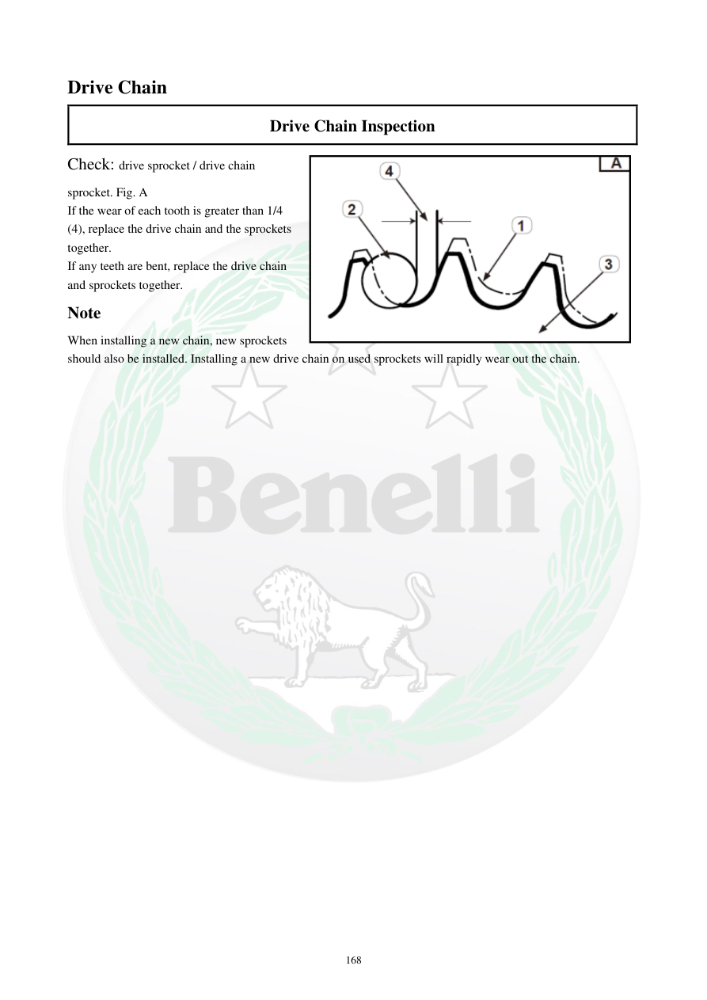

# Manual page 169

> Source: [page-0169.md](../source/page-0169.md)

## Page image / diagram

- [page-0169-img-01.png](../images/embedded/page-0169-img-01.png)

## Extracted text

# Source page 169

 
168 
Drive Chain 
Drive Chain Inspection 
Check: drive sprocket / drive chain 
sprocket. Fig. A 
If the wear of each tooth is greater than 1/4 
(4), replace the drive chain and the sprockets 
together. 
If any teeth are bent, replace the drive chain 
and sprockets together. 
Note 
When installing a new chain, new sprockets  
should also be installed. Installing a new drive chain on used sprockets will rapidly wear out the chain.

## Persian notes

### بازرسی چرخ‌دنده زنجیر
- دندانه چرخ‌دنده جلو/عقب را بررسی کنید.
- اگر میزان سایش هر دندانه بیش از **1/4** ارتفاع مشخص‌شده باشد، زنجیر و چرخ‌دنده‌ها را با هم تعویض کنید.
- دندانه خم‌شده نیز نیاز به تعویض هم‌زمان زنجیر و چرخ‌دنده‌ها دارد.
- زنجیر نو را روی چرخ‌دنده‌های فرسوده نصب نکنید، چون زنجیر نو سریع فرسوده می‌شود.
