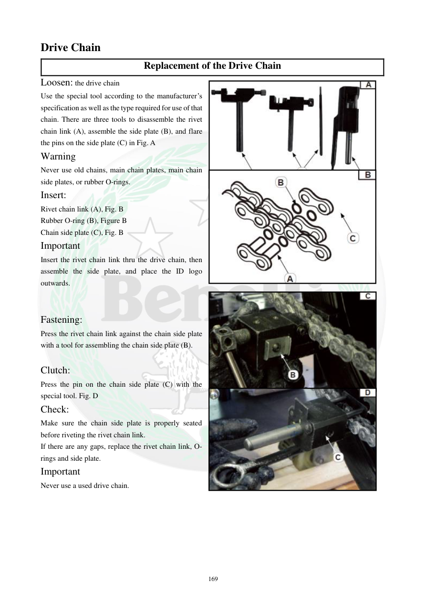

# Manual page 170

> Source: [page-0170.md](../source/page-0170.md)

## Page image / diagram

- [page-0170-img-01.jpeg](../images/embedded/page-0170-img-01.jpeg)

- [page-0170-img-02.jpeg](../images/embedded/page-0170-img-02.jpeg)

- [page-0170-img-03.jpeg](../images/embedded/page-0170-img-03.jpeg)

- [page-0170-img-04.jpeg](../images/embedded/page-0170-img-04.jpeg)

## Extracted text

# Source page 170

 
169 
Drive Chain 
Replacement of the Drive Chain 
Loosen: the drive chain 
Use the special tool according to the manufacturer’s 
specification as well as the type required for use of that 
chain. There are three tools to disassemble the rivet 
chain link (A), assemble the side plate (B), and flare 
the pins on the side plate (C) in Fig. A 
Warning 
Never use old chains, main chain plates, main chain 
side plates, or rubber O-rings. 
Insert: 
Rivet chain link (A), Fig. B 
Rubber O-ring (B), Figure B 
Chain side plate (C), Fig. B 
Important 
Insert the rivet chain link thru the drive chain, then 
assemble the side plate, and place the ID logo 
outwards. 
 
 
Fastening: 
Press the rivet chain link against the chain side plate 
with a tool for assembling the chain side plate (B). 
 
Clutch: 
Press the pin on the chain side plate (C) with the 
special tool. Fig. D 
Check: 
Make sure the chain side plate is properly seated 
before riveting the rivet chain link. 
If there are any gaps, replace the rivet chain link, O-
rings and side plate. 
Important 
Never use a used drive chain.

## Persian notes

<!-- Persian translation/explanation will be added here. -->
