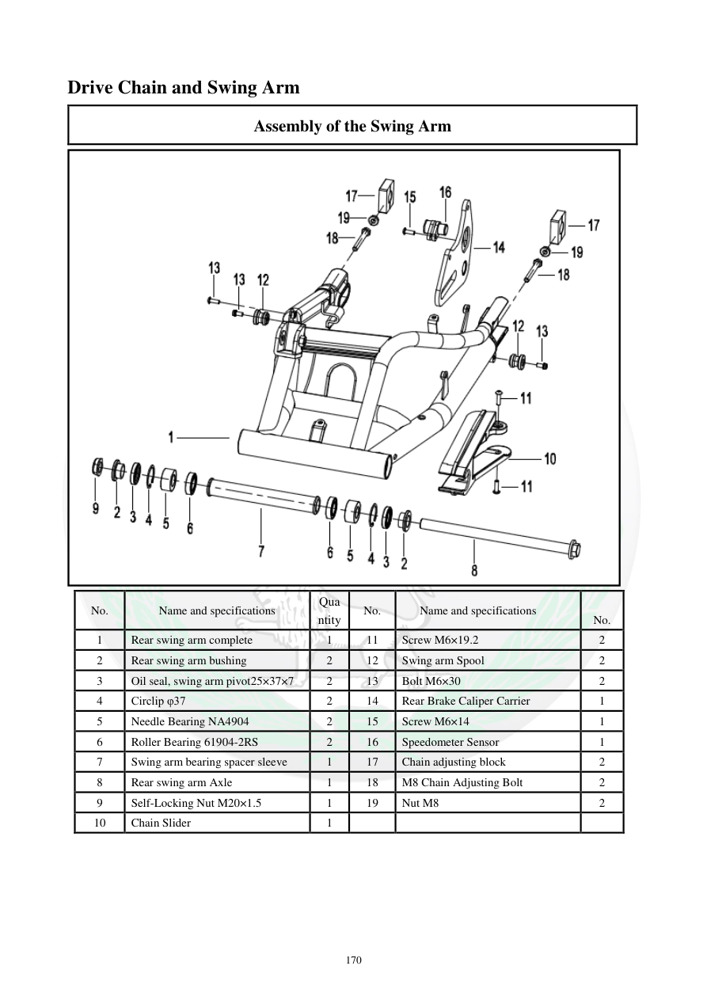

# Manual page 171

> Source: [page-0171.md](../source/page-0171.md)

## Page image / diagram

- [page-0171-img-01.png](../images/embedded/page-0171-img-01.png)

## Extracted text

# Source page 171

 
170 
Drive Chain and Swing Arm 
Assembly of the Swing Arm  
 
No. 
Name and specifications 
Qua
ntity 
No. 
Name and specifications 
 
No. 
1 
Rear swing arm complete 
1 
11 
Screw M6×19.2 
2 
2 
Rear swing arm bushing 
2 
12 
Swing arm Spool 
2 
3 
Oil seal, swing arm pivot25×37×7  
2 
13 
Bolt M6×30 
2 
4 
Circlip φ37 
2 
14 
Rear Brake Caliper Carrier  
1 
5 
Needle Bearing NA4904 
2 
15 
Screw M6×14 
1 
6 
Roller Bearing 61904-2RS  
2 
16 
Speedometer Sensor 
1 
7 
Swing arm bearing spacer sleeve 
1 
17 
Chain adjusting block 
2 
8 
Rear swing arm Axle 
1 
18 
M8 Chain Adjusting Bolt 
2 
9 
Self-Locking Nut M20×1.5  
1 
19 
Nut M8 
2 
10 
Chain Slider 
1

## Persian notes

<!-- Persian translation/explanation will be added here. -->
