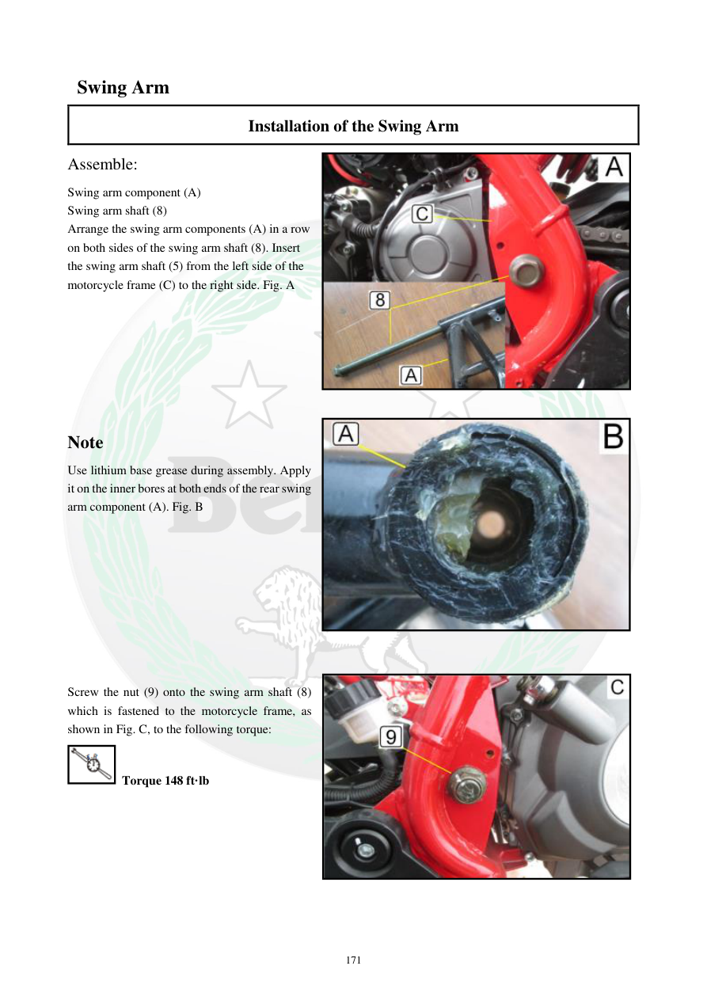

# Manual page 172

> Source: [page-0172.md](../source/page-0172.md)

## Page image / diagram

- [page-0172-img-02.jpeg](../images/embedded/page-0172-img-02.jpeg)

- [page-0172-img-03.jpeg](../images/embedded/page-0172-img-03.jpeg)

- [page-0172-img-04.jpeg](../images/embedded/page-0172-img-04.jpeg)

## Extracted text

# Source page 172

 
171 
 Swing Arm 
Installation of the Swing Arm 
Assemble: 
Swing arm component (A) 
Swing arm shaft (8) 
Arrange the swing arm components (A) in a row 
on both sides of the swing arm shaft (8). Insert 
the swing arm shaft (5) from the left side of the 
motorcycle frame (C) to the right side. Fig. A 
 
 
 
 
 
 
 
Note 
Use lithium base grease during assembly. Apply 
it on the inner bores at both ends of the rear swing 
arm component (A). Fig. B 
 
 
 
 
 
 
 
 
 
Screw the nut (9) onto the swing arm shaft (8) 
which is fastened to the motorcycle frame, as 
shown in Fig. C, to the following torque: 
 Torque 148 ft·lb

## Persian notes

### نصب بازوی نوسان
- قطعات بازوی نوسان را دو طرف محور مرتب کرده و محور **8** را از سمت چپ فریم به سمت راست وارد کنید.
- در محل‌های داخلی دو سر بازوی نوسان از گریس پایه لیتیم استفاده کنید.
- مهره محور بازوی نوسان را با گشتاور **148 ft·lb** ببندید.
