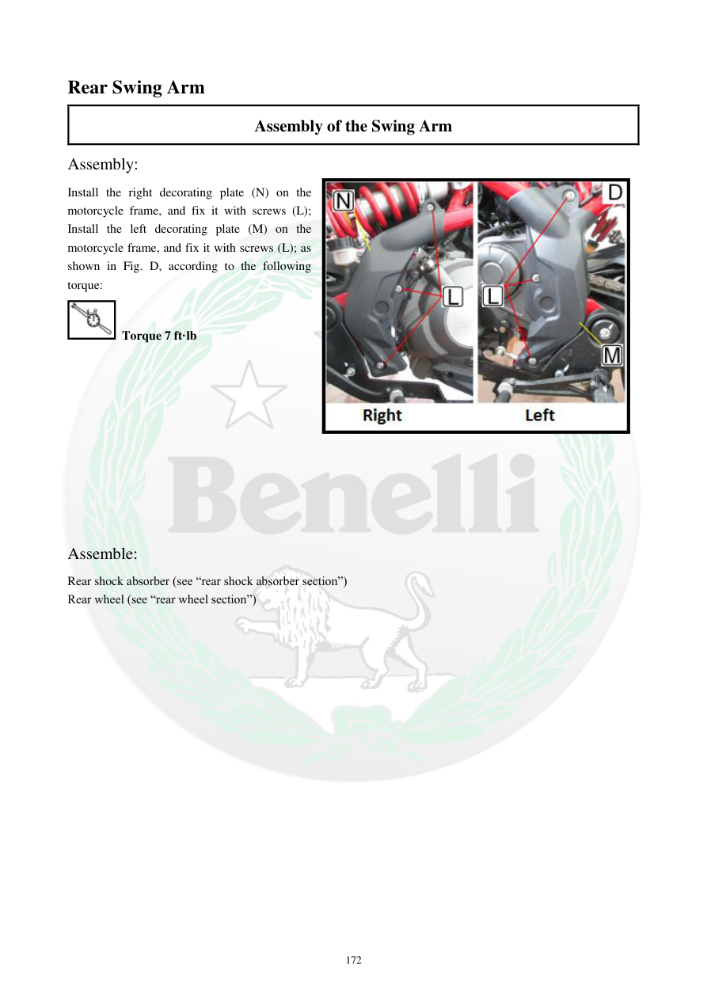

# Manual page 173

> Source: [page-0173.md](../source/page-0173.md)

## Page image / diagram

- [page-0173-img-02.jpeg](../images/embedded/page-0173-img-02.jpeg)

## Extracted text

# Source page 173

 
172 
Rear Swing Arm 
Assembly of the Swing Arm 
Assembly: 
Install the right decorating plate (N) on the 
motorcycle frame, and fix it with screws (L); 
Install the left decorating plate (M) on the 
motorcycle frame, and fix it with screws (L); as 
shown in Fig. D, according to the following 
torque: 
 Torque 7 ft·lb 
 
 
 
 
 
 
 
 
 
 
Assemble: 
Rear shock absorber (see “rear shock absorber section”) 
Rear wheel (see “rear wheel section”)

## Persian notes

### تکمیل مونتاژ بازوی نوسان
- صفحه تزئینی راست و چپ فریم را نصب کنید.
- پیچ‌های صفحات تزئینی با گشتاور **7 ft·lb** بسته شوند.
- سپس کمک عقب و چرخ عقب طبق بخش‌های مربوطه نصب می‌شوند.
