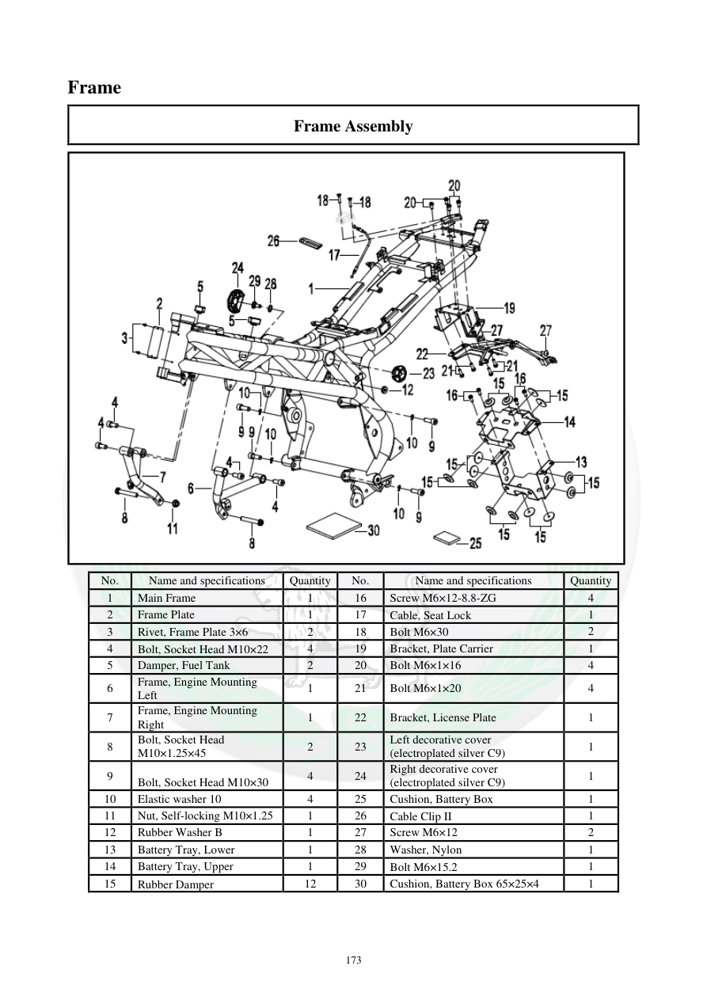

# Manual page 174

> Source: [page-0174.md](../source/page-0174.md)

## Page image / diagram

- [page-0174-img-01.png](../images/embedded/page-0174-img-01.png)

## Extracted text

# Source page 174

 
173 
Frame 
Frame Assembly 
 
No.  
Name and specifications 
Quantity 
No. 
Name and specifications 
Quantity 
1 
Main Frame 
1 
16 
Screw M6×12-8.8-ZG 
4 
2 
Frame Plate 
1 
17 
Cable, Seat Lock 
1 
3 
Rivet, Frame Plate 3×6 
2 
18 
Bolt M6×30 
2 
4 
Bolt, Socket Head M10×22 
4 
19 
Bracket, Plate Carrier 
1 
5 
Damper, Fuel Tank 
2 
20 
Bolt M6×1×16 
4 
6 
Frame, Engine Mounting 
Left 
1 
21 
Bolt M6×1×20 
4 
7 
Frame, Engine Mounting 
Right 
1 
22 
Bracket, License Plate  
1 
8 
Bolt, Socket Head 
M10×1.25×45 
2 
23 
Left decorative cover 
(electroplated silver C9) 
1 
9 
Bolt, Socket Head M10×30 
4 
24 
Right decorative cover 
(electroplated silver C9) 
1 
10 
Elastic washer 10 
4 
25 
Cushion, Battery Box 
1 
11 
Nut, Self-locking M10×1.25 
1 
26 
Cable Clip II 
1 
12 
Rubber Washer B 
1 
27 
Screw M6×12 
2 
13 
Battery Tray, Lower 
1 
28 
Washer, Nylon 
1 
14 
Battery Tray, Upper 
1 
29 
Bolt M6×15.2 
1 
15 
Rubber Damper 
12 
30 
Cushion, Battery Box 65×25×4 
1

## Persian notes

<!-- Persian translation/explanation will be added here. -->
