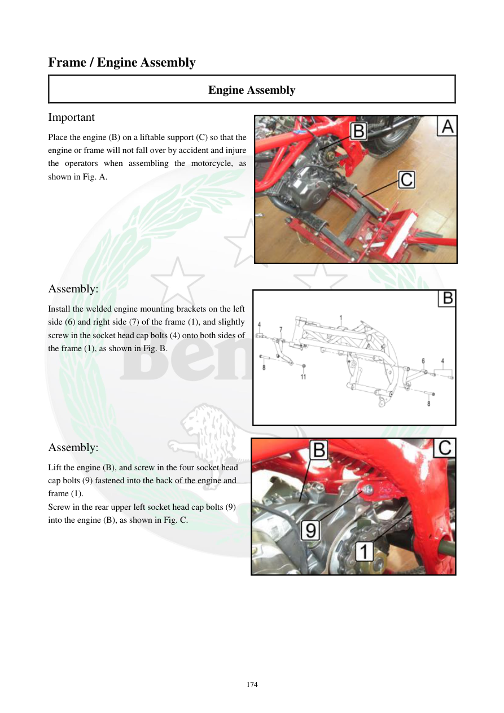

# Manual page 175

> Source: [page-0175.md](../source/page-0175.md)

## Page image / diagram

- [page-0175-img-01.jpeg](../images/embedded/page-0175-img-01.jpeg)

- [page-0175-img-02.png](../images/embedded/page-0175-img-02.png)

- [page-0175-img-03.jpeg](../images/embedded/page-0175-img-03.jpeg)

## Extracted text

# Source page 175

 
174 
Frame / Engine Assembly 
Engine Assembly 
Important 
Place the engine (B) on a liftable support (C) so that the 
engine or frame will not fall over by accident and injure 
the operators when assembling the motorcycle, as 
shown in Fig. A. 
 
 
 
 
 
 
 
Assembly: 
Install the welded engine mounting brackets on the left 
side (6) and right side (7) of the frame (1), and slightly 
screw in the socket head cap bolts (4) onto both sides of 
the frame (1), as shown in Fig. B. 
 
 
 
 
 
 
Assembly: 
Lift the engine (B), and screw in the four socket head 
cap bolts (9) fastened into the back of the engine and 
frame (1). 
Screw in the rear upper left socket head cap bolts (9) 
into the engine (B), as shown in Fig. C.

## Persian notes

<!-- Persian translation/explanation will be added here. -->
