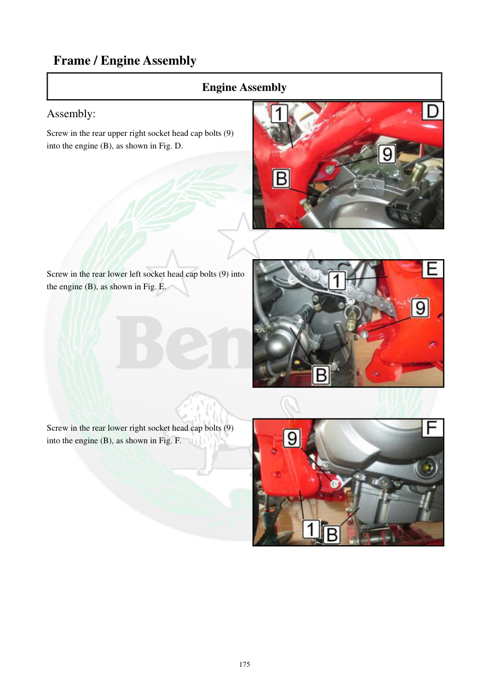

# Manual page 176

> Source: [page-0176.md](../source/page-0176.md)

## Page image / diagram

- [page-0176-img-01.jpeg](../images/embedded/page-0176-img-01.jpeg)

- [page-0176-img-02.jpeg](../images/embedded/page-0176-img-02.jpeg)

- [page-0176-img-03.jpeg](../images/embedded/page-0176-img-03.jpeg)

## Extracted text

# Source page 176

 
175 
 Frame / Engine Assembly 
Engine Assembly 
Assembly:  
Screw in the rear upper right socket head cap bolts (9) 
into the engine (B), as shown in Fig. D. 
 
 
 
 
 
 
 
 
 
Screw in the rear lower left socket head cap bolts (9) into 
the engine (B), as shown in Fig. E. 
 
 
 
 
 
 
 
 
 
 
Screw in the rear lower right socket head cap bolts (9) 
into the engine (B), as shown in Fig. F.

## Persian notes

### ادامه نصب موتور
- پیچ اتصال بالایی عقب سمت راست **9** را نصب کنید.
- سپس پیچ اتصال پایینی عقب سمت چپ **9** و پایینی عقب سمت راست **9** را نصب کنید.
- ترتیب محل پیچ‌ها طبق تصاویر صفحه است.
