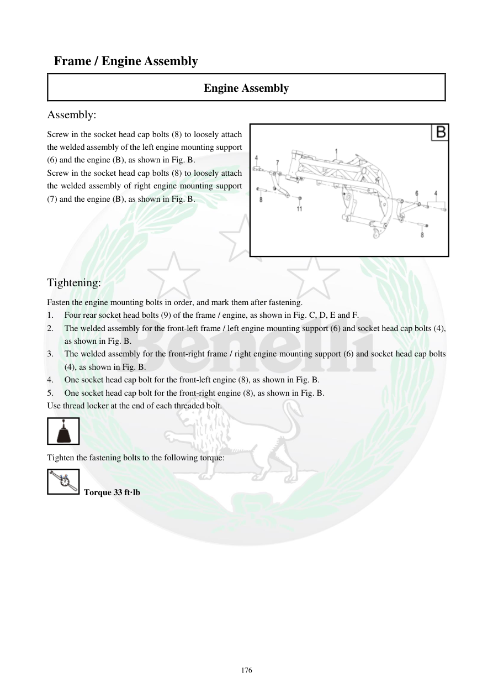

# Manual page 177

> Source: [page-0177.md](../source/page-0177.md)

## Page image / diagram

- [page-0177-img-03.png](../images/embedded/page-0177-img-03.png)

## Extracted text

# Source page 177

 
176 
 Frame / Engine Assembly 
Engine Assembly 
Assembly: 
Screw in the socket head cap bolts (8) to loosely attach 
the welded assembly of the left engine mounting support 
(6) and the engine (B), as shown in Fig. B. 
Screw in the socket head cap bolts (8) to loosely attach 
the welded assembly of right engine mounting support 
(7) and the engine (B), as shown in Fig. B. 
 
 
 
 
 
Tightening: 
Fasten the engine mounting bolts in order, and mark them after fastening. 
1. 
Four rear socket head bolts (9) of the frame / engine, as shown in Fig. C, D, E and F. 
2. 
The welded assembly for the front-left frame / left engine mounting support (6) and socket head cap bolts (4), 
as shown in Fig. B. 
3. 
The welded assembly for the front-right frame / right engine mounting support (6) and socket head cap bolts 
(4), as shown in Fig. B. 
4. 
One socket head cap bolt for the front-left engine (8), as shown in Fig. B. 
5. 
One socket head cap bolt for the front-right engine (8), as shown in Fig. B. 
Use thread locker at the end of each threaded bolt. 
 
Tighten the fastening bolts to the following torque: 
 Torque 33 ft·lb

## Persian notes

<!-- Persian translation/explanation will be added here. -->
