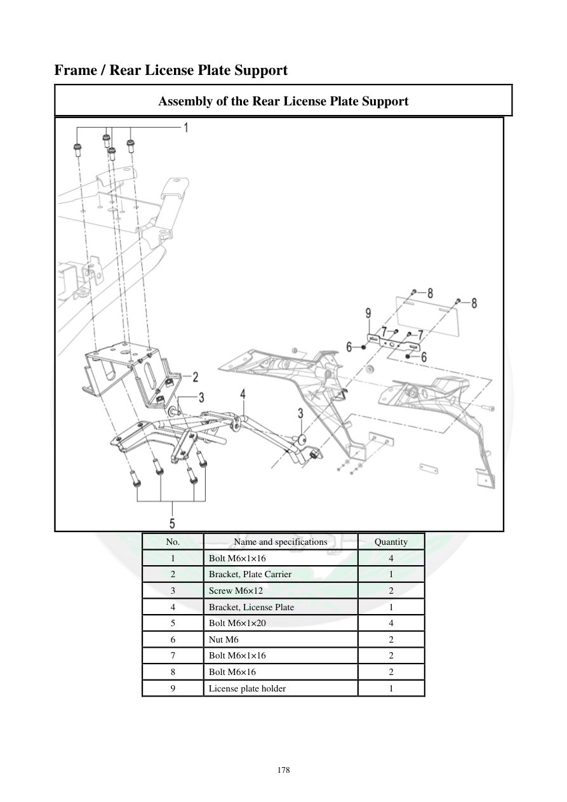

# Manual page 179

> Source: [page-0179.md](../source/page-0179.md)

## Page image / diagram

- [page-0179-img-02.png](../images/embedded/page-0179-img-02.png)

## Extracted text

# Source page 179

 
178 
Frame / Rear License Plate Support 
Assembly of the Rear License Plate Support 
 
No. 
Name and specifications 
Quantity 
1 
Bolt M6×1×16 
4 
2 
Bracket, Plate Carrier 
1 
3 
Screw M6×12 
2 
4 
Bracket, License Plate 
1 
5 
Bolt M6×1×20 
4 
6 
Nut M6 
2 
7 
Bolt M6×1×16 
2 
8 
Bolt M6×16 
2 
9 
License plate holder 
1

## Persian notes

<!-- Persian translation/explanation will be added here. -->
