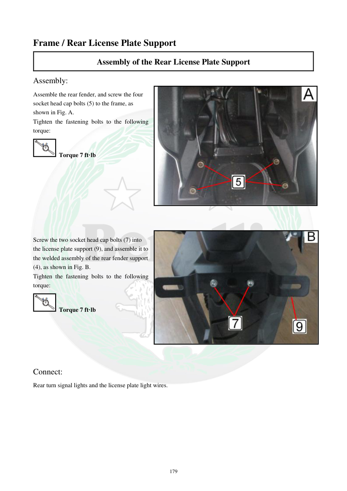

# Manual page 180

> Source: [page-0180.md](../source/page-0180.md)

## Page image / diagram

- [page-0180-img-02.jpeg](../images/embedded/page-0180-img-02.jpeg)

- [page-0180-img-03.jpeg](../images/embedded/page-0180-img-03.jpeg)

## Extracted text

# Source page 180

 
179 
Frame / Rear License Plate Support 
Assembly of the Rear License Plate Support 
Assembly: 
Assemble the rear fender, and screw the four 
socket head cap bolts (5) to the frame, as 
shown in Fig. A. 
Tighten the fastening bolts to the following 
torque: 
 Torque 7 ft·lb 
 
 
 
 
 
 
 
 
Screw the two socket head cap bolts (7) into 
the license plate support (9), and assemble it to 
the welded assembly of the rear fender support 
(4), as shown in Fig. B. 
Tighten the fastening bolts to the following 
torque: 
 Torque 7 ft·lb 
 
 
 
 
 
Connect: 
Rear turn signal lights and the license plate light wires.

## Persian notes

<!-- Persian translation/explanation will be added here. -->
