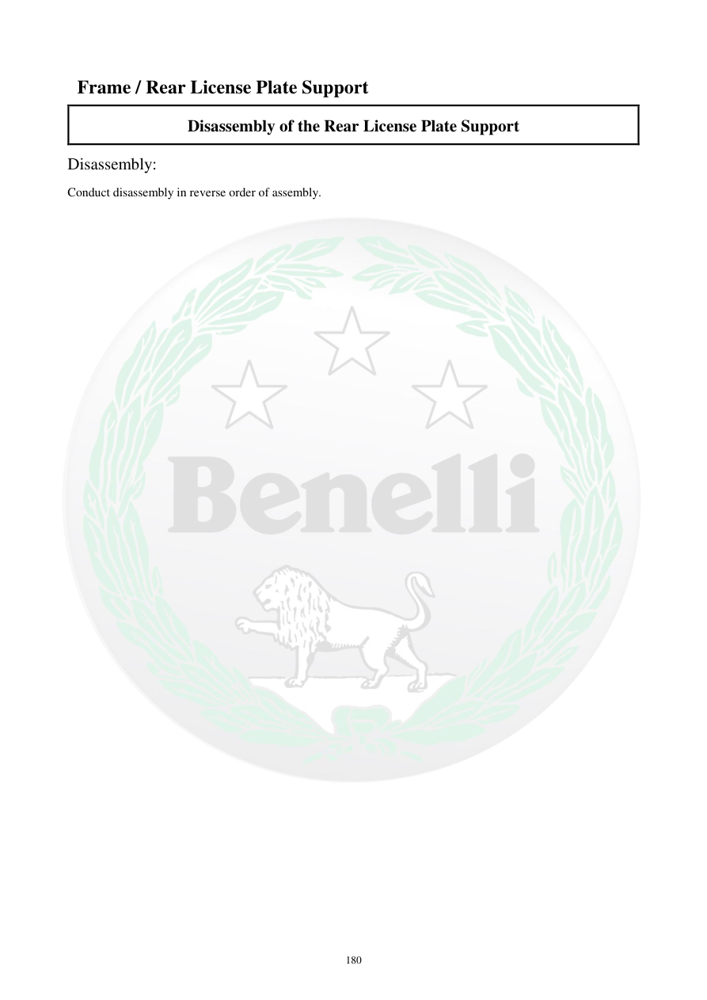

# Manual page 181

> Source: [page-0181.md](../source/page-0181.md)

## Page image / diagram

## Extracted text

# Source page 181

 
180 
 Frame / Rear License Plate Support 
Disassembly of the Rear License Plate Support 
Disassembly: 
Conduct disassembly in reverse order of assembly.

## Persian notes

### بازکردن پایه پلاک عقب
- بازکردن طبق ترتیب معکوس مونتاژ انجام شود.
