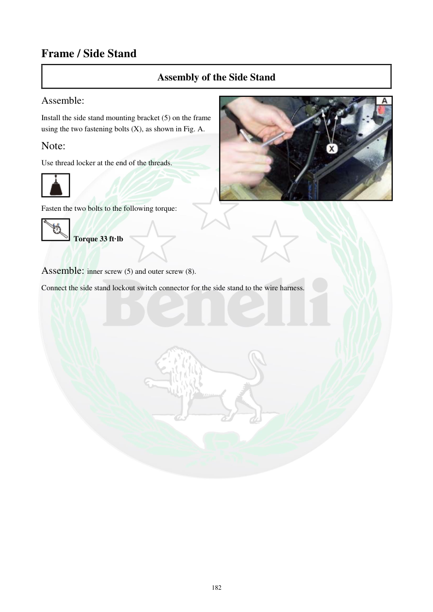

# Manual page 183

> Source: [page-0183.md](../source/page-0183.md)

## Page image / diagram

- [page-0183-img-03.jpeg](../images/embedded/page-0183-img-03.jpeg)

## Extracted text

# Source page 183

 
182 
Frame / Side Stand 
Assembly of the Side Stand 
Assemble: 
Install the side stand mounting bracket (5) on the frame 
using the two fastening bolts (X), as shown in Fig. A. 
Note: 
Use thread locker at the end of the threads. 
 
Fasten the two bolts to the following torque: 
 Torque 33 ft·lb 
 
Assemble: inner screw (5) and outer screw (8). 
Connect the side stand lockout switch connector for the side stand to the wire harness.

## Persian notes

### نصب جک بغل
- براکت جک بغل **5** با دو پیچ اتصال **X** روی فریم نصب شود.
- انتهای رزوه پیچ‌ها thread locker داشته باشد.
- گشتاور دو پیچ براکت: **33 ft·lb**.
- پیچ داخلی **5** و پیچ خارجی **8** نصب شوند.
- کانکتور کلید ایمنی جک بغل به دسته‌سیم متصل شود.
