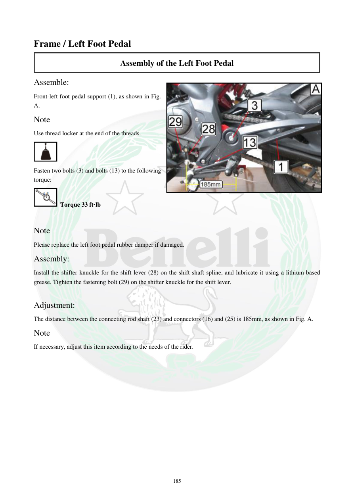

# Manual page 186

> Source: [page-0186.md](../source/page-0186.md)

## Page image / diagram

- [page-0186-img-03.jpeg](../images/embedded/page-0186-img-03.jpeg)

## Extracted text

# Source page 186

 
185 
Frame / Left Foot Pedal 
Assembly of the Left Foot Pedal 
Assemble: 
Front-left foot pedal support (1), as shown in Fig. 
A. 
Note 
Use thread locker at the end of the threads. 
 
Fasten two bolts (3) and bolts (13) to the following 
torque: 
 Torque 33 ft·lb 
 
Note 
Please replace the left foot pedal rubber damper if damaged. 
Assembly: 
Install the shifter knuckle for the shift lever (28) on the shift shaft spline, and lubricate it using a lithium-based 
grease. Tighten the fastening bolt (29) on the shifter knuckle for the shift lever. 
 
Adjustment: 
The distance between the connecting rod shaft (23) and connectors (16) and (25) is 185mm, as shown in Fig. A. 
Note 
If necessary, adjust this item according to the needs of the rider.

## Persian notes

### نصب و تنظیم پدال پای چپ
- پایه پدال جلوی چپ نصب شود و روی رزوه پیچ‌ها thread locker استفاده شود.
- گشتاور پیچ‌های **3** و **13**: **33 ft·lb**.
- ضربه‌گیر لاستیکی پدال در صورت آسیب تعویض شود.
- مفصل دسته دنده **28** روی هزارخار محور دنده نصب و با گریس پایه لیتیم روان‌کاری شود؛ پیچ **29** محکم شود.
- فاصله بین میله اتصال **23** و رابط‌های **16** و **25** طبق دفترچه **185 mm** است و در صورت نیاز می‌تواند متناسب با وضعیت راننده تنظیم شود.
