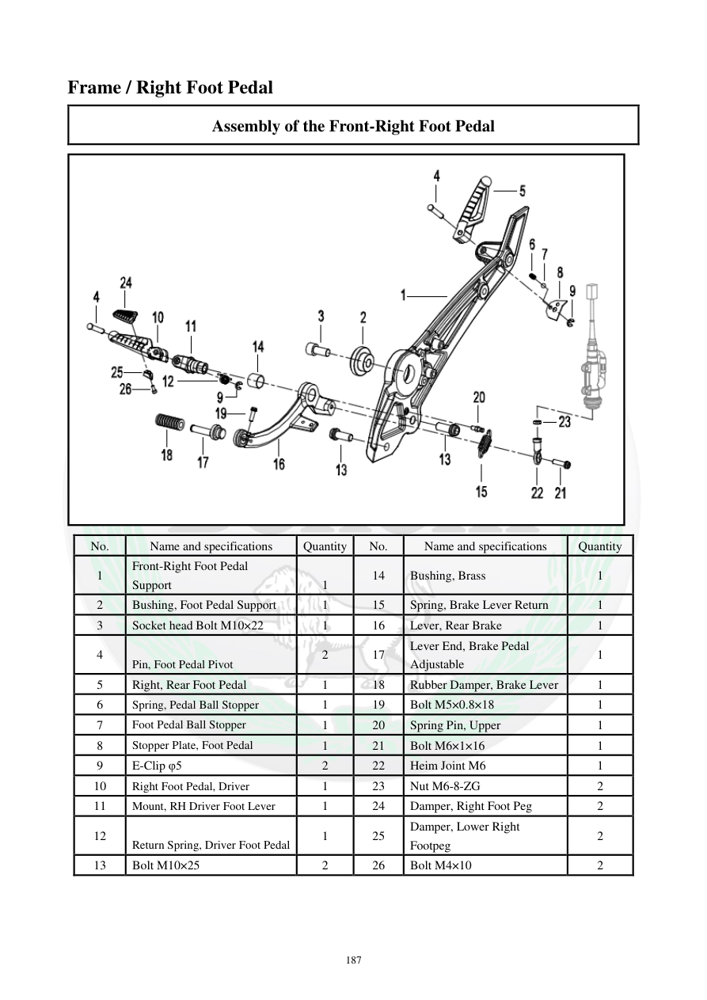

# Manual page 188

> Source: [page-0188.md](../source/page-0188.md)

## Page image / diagram

- [page-0188-img-01.png](../images/embedded/page-0188-img-01.png)

## Extracted text

# Source page 188

 
187 
Frame / Right Foot Pedal 
Assembly of the Front-Right Foot Pedal 
 
No. 
Name and specifications 
Quantity 
No. 
Name and specifications 
Quantity 
1 
Front-Right Foot Pedal 
Support 
1 
14 
Bushing, Brass 
1 
2 
Bushing, Foot Pedal Support 
1 
15 
Spring, Brake Lever Return 
1 
3 
Socket head Bolt M10×22 
1 
16 
Lever, Rear Brake 
1 
4 
Pin, Foot Pedal Pivot 
2 
17 
Lever End, Brake Pedal 
Adjustable 
1 
5 
Right, Rear Foot Pedal 
1 
18 
Rubber Damper, Brake Lever  
1 
6 
Spring, Pedal Ball Stopper 
1 
19 
Bolt M5×0.8×18 
1 
7 
Foot Pedal Ball Stopper 
1 
20 
Spring Pin, Upper 
1 
8 
Stopper Plate, Foot Pedal 
1 
21 
Bolt M6×1×16 
1 
9 
E-Clip φ5 
2 
22 
Heim Joint M6 
1 
10 
Right Foot Pedal, Driver 
1 
23 
Nut M6-8-ZG 
2 
11 
Mount, RH Driver Foot Lever 
1 
24 
Damper, Right Foot Peg 
2 
12 
Return Spring, Driver Foot Pedal 
1 
25 
Damper, Lower Right 
Footpeg 
2 
13 
Bolt M10×25 
2 
26 
Bolt M4×10 
2

## Persian notes

<!-- Persian translation/explanation will be added here. -->
