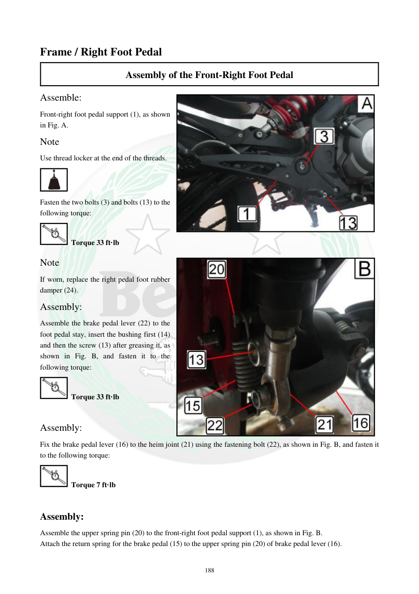

# Manual page 189

> Source: [page-0189.md](../source/page-0189.md)

## Page image / diagram

- [page-0189-img-03.jpeg](../images/embedded/page-0189-img-03.jpeg)

- [page-0189-img-04.jpeg](../images/embedded/page-0189-img-04.jpeg)

## Extracted text

# Source page 189

 
188 
Frame / Right Foot Pedal 
Assembly of the Front-Right Foot Pedal 
Assemble: 
Front-right foot pedal support (1), as shown 
in Fig. A. 
Note 
Use thread locker at the end of the threads. 
 
Fasten the two bolts (3) and bolts (13) to the 
following torque: 
 Torque 33 ft·lb 
Note 
If worn, replace the right pedal foot rubber 
damper (24). 
Assembly: 
Assemble the brake pedal lever (22) to the 
foot pedal stay, insert the bushing first (14) 
and then the screw (13) after greasing it, as 
shown in Fig. B, and fasten it to the 
following torque: 
 Torque 33 ft·lb  
 
Assembly: 
Fix the brake pedal lever (16) to the heim joint (21) using the fastening bolt (22), as shown in Fig. B, and fasten it 
to the following torque: 
 Torque 7 ft·lb 
 
Assembly: 
Assemble the upper spring pin (20) to the front-right foot pedal support (1), as shown in Fig. B. 
Attach the return spring for the brake pedal (15) to the upper spring pin (20) of brake pedal lever (16).

## Persian notes

<!-- Persian translation/explanation will be added here. -->
