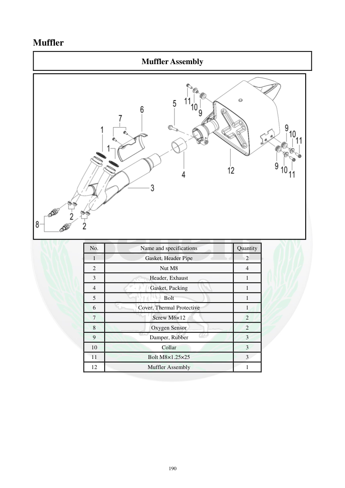

# Manual page 191

> Source: [page-0191.md](../source/page-0191.md)

## Page image / diagram

- [page-0191-img-02.png](../images/embedded/page-0191-img-02.png)

## Extracted text

# Source page 191

 
190 
Muffler 
Muffler Assembly 
 
No. 
Name and specifications 
Quantity 
1 
Gasket, Header Pipe 
2 
2 
Nut M8 
4 
3 
Header, Exhaust 
1 
4 
Gasket, Packing 
1 
5 
Bolt 
1 
6 
Cover, Thermal Protective 
1 
7 
Screw M6×12 
2 
8 
Oxygen Sensor 
2 
9 
Damper, Rubber 
3 
10 
Collar 
3 
11 
Bolt M8×1.25×25 
3 
12 
Muffler Assembly 
1

## Persian notes

<!-- Persian translation/explanation will be added here. -->
