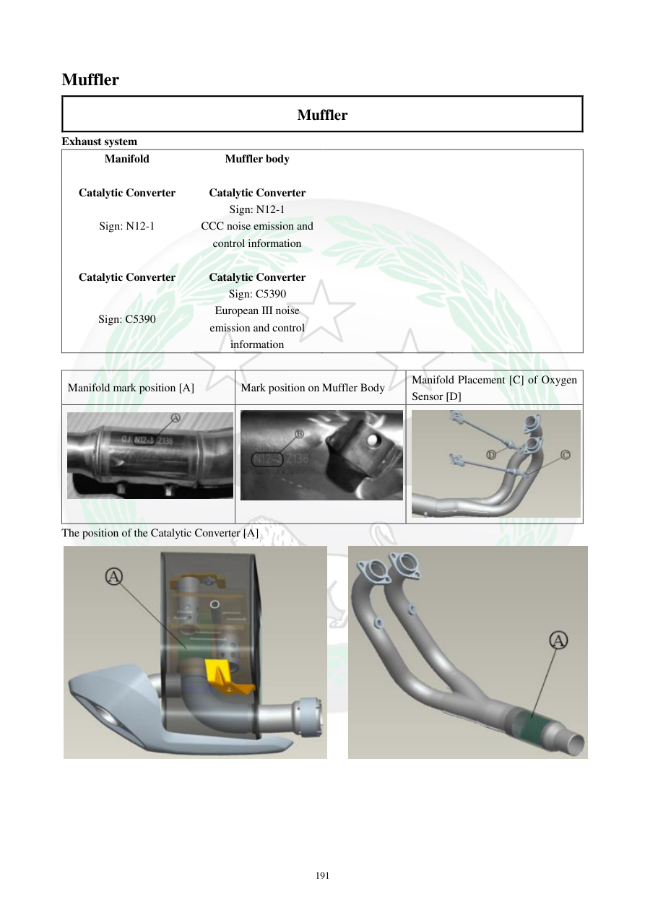

# Manual page 192

> Source: [page-0192.md](../source/page-0192.md)

## Page image / diagram

- [page-0192-img-01.jpeg](../images/embedded/page-0192-img-01.jpeg)

- [page-0192-img-02.jpeg](../images/embedded/page-0192-img-02.jpeg)

- [page-0192-img-03.jpeg](../images/embedded/page-0192-img-03.jpeg)

- [page-0192-img-04.jpeg](../images/embedded/page-0192-img-04.jpeg)

- [page-0192-img-05.jpeg](../images/embedded/page-0192-img-05.jpeg)

## Extracted text

# Source page 192

 
191 
Muffler 
Muffler 
Exhaust system 
Manifold 
Muffler body 
 
 
 
 
 
 
Catalytic Converter 
Catalytic Converter 
 
 
 
Sign: N12-1 
 
Sign: N12-1 
CCC noise emission and 
control information 
 
 
 
 
 
 
Catalytic Converter 
Catalytic Converter 
 
 
Sign: C5390 
Sign: C5390 
European III noise 
emission and control 
information 
 
 
 
Manifold mark position [A] 
Mark position on Muffler Body 
Manifold Placement [C] of Oxygen 
Sensor [D] 
 
 
 
The position of the Catalytic Converter [A]

## Persian notes

### مشخصات و علائم سیستم اگزوز
این صفحه محل اجزای اصلی سیستم اگزوز و مبدل کاتالیستی را نشان می‌دهد و موقعیت علامت‌های مربوط به اطلاعات آلایندگی/صدا و محل سنسور اکسیژن را مشخص می‌کند. برای تشخیص محل دقیق علامت‌ها و قطعات، تصویر صفحه مرجع اصلی است.
