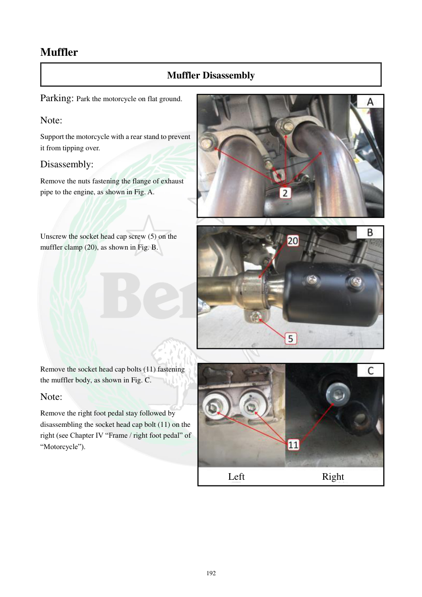

# Manual page 193

> Source: [page-0193.md](../source/page-0193.md)

## Page image / diagram

- [page-0193-img-01.jpeg](../images/embedded/page-0193-img-01.jpeg)

- [page-0193-img-02.jpeg](../images/embedded/page-0193-img-02.jpeg)

- [page-0193-img-03.jpeg](../images/embedded/page-0193-img-03.jpeg)

## Extracted text

# Source page 193

 
192 
Muffler 
Muffler Disassembly 
Parking: Park the motorcycle on flat ground. 
Note: 
Support the motorcycle with a rear stand to prevent 
it from tipping over. 
Disassembly: 
Remove the nuts fastening the flange of exhaust 
pipe to the engine, as shown in Fig. A. 
 
 
 
Unscrew the socket head cap screw (5) on the 
muffler clamp (20), as shown in Fig. B. 
 
 
 
 
 
 
 
 
 
 
Remove the socket head cap bolts (11) fastening 
the muffler body, as shown in Fig. C. 
Note: 
Remove the right foot pedal stay followed by 
disassembling the socket head cap bolt (11) on the 
right (see Chapter IV “Frame / right foot pedal” of 
“Motorcycle”). 
 
 
 
 
 
 
Left  
Right

## Persian notes

### بازکردن منبع اگزوز
- موتور را روی سطح صاف پارک کنید و برای جلوگیری از واژگونی از پایه عقب استفاده کنید.
- مهره‌های فلنج لوله اگزوز را از موتور باز کنید.
- پیچ آلن **5** روی بست Muffler را باز کنید.
- پیچ‌های آلن **11** نگهدارنده بدنه Muffler را باز کنید.
- برای دسترسی به پیچ سمت راست، ابتدا پایه پدال پای راست را باز کنید؛ دفترچه برای جزئیات به فصل **Frame / Right Foot Pedal** ارجاع می‌دهد.
