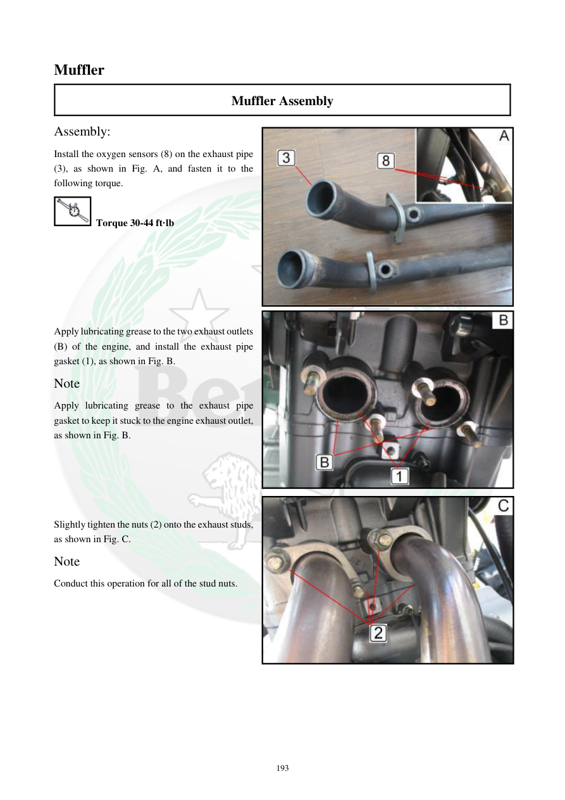

# Manual page 194

> Source: [page-0194.md](../source/page-0194.md)

## Page image / diagram

- [page-0194-img-02.jpeg](../images/embedded/page-0194-img-02.jpeg)

- [page-0194-img-03.jpeg](../images/embedded/page-0194-img-03.jpeg)

- [page-0194-img-04.jpeg](../images/embedded/page-0194-img-04.jpeg)

## Extracted text

# Source page 194

 
193 
Muffler 
Muffler Assembly 
Assembly: 
Install the oxygen sensors (8) on the exhaust pipe 
(3), as shown in Fig. A, and fasten it to the 
following torque. 
 Torque 30-44 ft·lb 
 
 
 
 
 
 
Apply lubricating grease to the two exhaust outlets 
(B) of the engine, and install the exhaust pipe 
gasket (1), as shown in Fig. B. 
Note 
Apply lubricating grease to the exhaust pipe 
gasket to keep it stuck to the engine exhaust outlet, 
as shown in Fig. B. 
 
 
 
 
 
Slightly tighten the nuts (2) onto the exhaust studs, 
as shown in Fig. C. 
Note 
Conduct this operation for all of the stud nuts.

## Persian notes

### نصب اولیه اگزوز
- سنسورهای اکسیژن **8** روی لوله اگزوز **3** نصب شوند؛ گشتاور: **30–44 ft·lb**.
- روی دو خروجی اگزوز موتور گریس روان‌کننده بزنید و واشر لوله اگزوز **1** را نصب کنید.
- برای چسبیدن واشر به خروجی موتور، مقدار کمی گریس روی خود واشر اعمال شود.
- مهره‌های **2** روی استادهای اگزوز ابتدا کمی سفت شوند و این کار برای همه استادها انجام شود.
