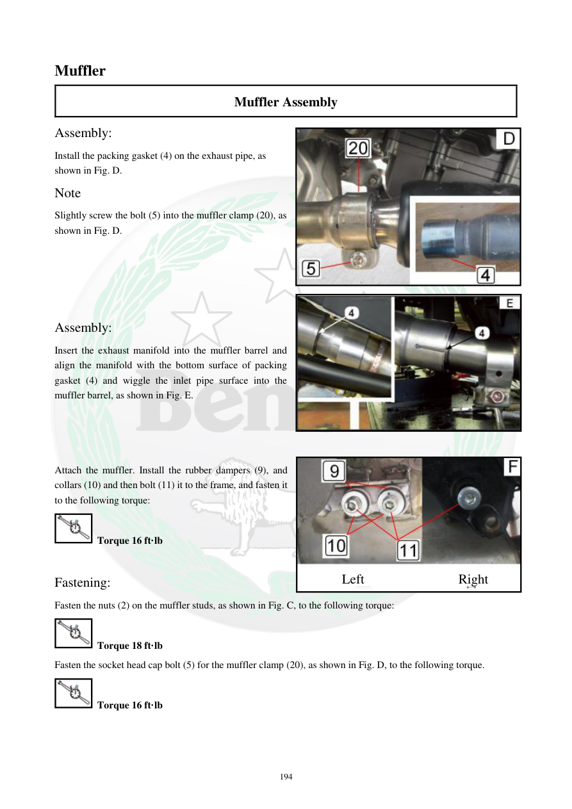

# Manual page 195

> Source: [page-0195.md](../source/page-0195.md)

## Page image / diagram

- [page-0195-img-02.jpeg](../images/embedded/page-0195-img-02.jpeg)

- [page-0195-img-03.jpeg](../images/embedded/page-0195-img-03.jpeg)

- [page-0195-img-04.jpeg](../images/embedded/page-0195-img-04.jpeg)

## Extracted text

# Source page 195

 
194 
Muffler 
Muffler Assembly 
Assembly: 
Install the packing gasket (4) on the exhaust pipe, as 
shown in Fig. D. 
Note 
Slightly screw the bolt (5) into the muffler clamp (20), as 
shown in Fig. D. 
 
 
 
 
Assembly: 
Insert the exhaust manifold into the muffler barrel and 
align the manifold with the bottom surface of packing 
gasket (4) and wiggle the inlet pipe surface into the 
muffler barrel, as shown in Fig. E. 
 
 
 
 
Attach the muffler. Install the rubber dampers (9), and 
collars (10) and then bolt (11) it to the frame, and fasten it 
to the following torque: 
 Torque 16 ft·lb 
 
Fastening: 
Fasten the nuts (2) on the muffler studs, as shown in Fig. C, to the following torque: 
 Torque 18 ft·lb 
Fasten the socket head cap bolt (5) for the muffler clamp (20), as shown in Fig. D, to the following torque. 
 Torque 16 ft·lb 
 
 
Left  
Right

## Persian notes

### تکمیل مونتاژ اگزوز
- واشر packing **4** روی لوله اگزوز نصب شود.
- پیچ **5** بست Muffler ابتدا کمی بسته شود.
- هدر اگزوز داخل بدنه Muffler قرار گیرد و با سطح زیرین واشر **4** هم‌راستا شود.
- ضربه‌گیرهای لاستیکی **9**، Collarهای **10** و پیچ‌های **11** نصب شوند؛ گشتاور اتصال به فریم: **16 ft·lb**.
- مهره‌های استاد اگزوز **2**: **18 ft·lb**.
- پیچ بست Muffler **5**: **16 ft·lb**.
