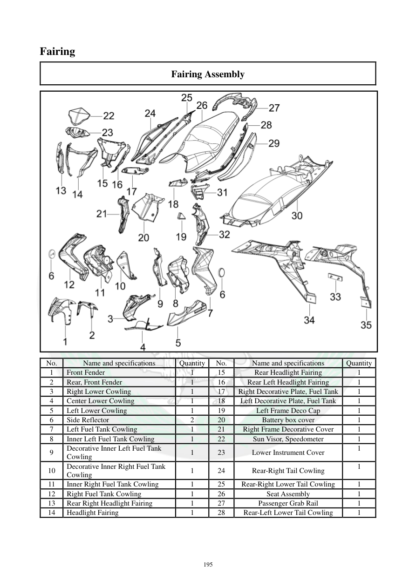

# Manual page 196

> Source: [page-0196.md](../source/page-0196.md)

## Page image / diagram

- [page-0196-img-02.png](../images/embedded/page-0196-img-02.png)

## Extracted text

# Source page 196

 
195 
Fairing 
Fairing Assembly 
 
No. 
Name and specifications 
Quantity 
No. 
Name and specifications 
Quantity 
1 
Front Fender 
1 
15 
Rear Headlight Fairing 
1 
2 
Rear, Front Fender 
1 
16 
Rear Left Headlight Fairing 
1 
3 
Right Lower Cowling 
1 
17 
Right Decorative Plate, Fuel Tank 
1 
4 
Center Lower Cowling 
1 
18 
Left Decorative Plate, Fuel Tank 
1 
5 
Left Lower Cowling 
1 
19 
Left Frame Deco Cap 
1 
6 
Side Reflector 
2 
20 
Battery box cover 
1 
7 
Left Fuel Tank Cowling 
1 
21 
Right Frame Decorative Cover 
1 
8 
Inner Left Fuel Tank Cowling 
1 
22 
Sun Visor, Speedometer 
1 
9 
Decorative Inner Left Fuel Tank 
Cowling 
1 
23 
Lower Instrument Cover 
1 
10 
Decorative Inner Right Fuel Tank 
Cowling 
1 
24 
Rear-Right Tail Cowling 
1 
11 
Inner Right Fuel Tank Cowling 
1 
25 
Rear-Right Lower Tail Cowling 
1 
12 
Right Fuel Tank Cowling 
1 
26 
Seat Assembly 
1 
13 
Rear Right Headlight Fairing 
1 
27 
Passenger Grab Rail 
1 
14 
Headlight Fairing 
1 
28 
Rear-Left Lower Tail Cowling 
1

## Persian notes

### اجزای فلاپینگ و پوشش‌های بدنه
این صفحه فهرست قطعات اصلی پوشش‌های بدنه را ثبت می‌کند، از جمله گلگیر جلو، کاول‌های پایین، پوشش‌های اطراف باک، قاب‌های چراغ، پوشش جعبه باتری، پوشش کیلومتر، کاول‌های دم عقب، صندلی و دستگیره سرنشین. محل دقیق هر قطعه با تصویر صفحه کنترل شود.
