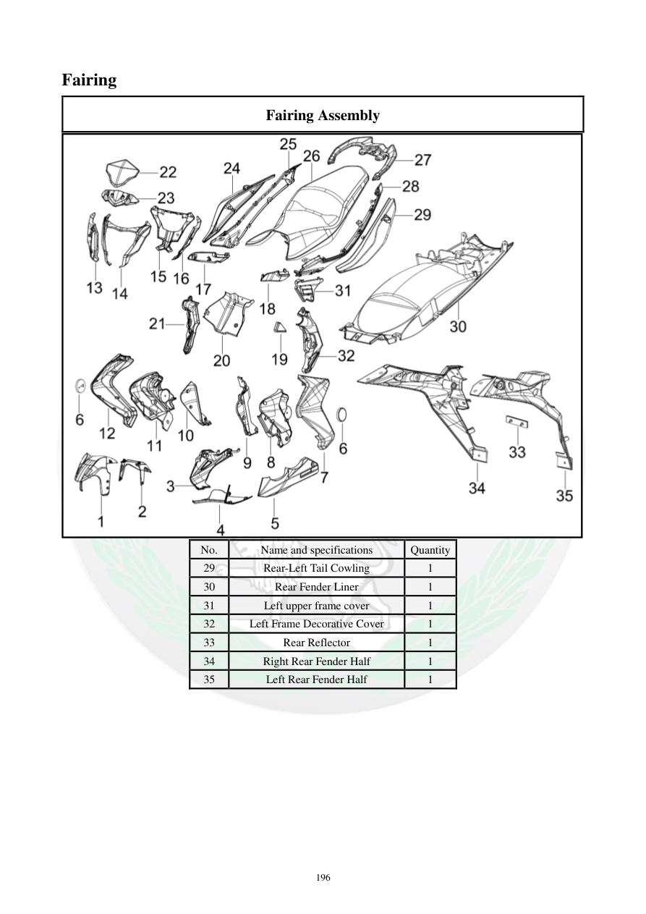

# Manual page 197

> Source: [page-0197.md](../source/page-0197.md)

## Page image / diagram

## Extracted text

# Source page 197

 
196 
Fairing 
Fairing Assembly 
 
No. 
Name and specifications 
Quantity 
29 
Rear-Left Tail Cowling 
1 
30 
Rear Fender Liner 
1 
31 
Left upper frame cover 
1 
32 
Left Frame Decorative Cover 
1 
33 
Rear Reflector 
1 
34 
Right Rear Fender Half 
1 
35 
Left Rear Fender Half 
1

## Persian notes

<!-- Persian translation/explanation will be added here. -->
