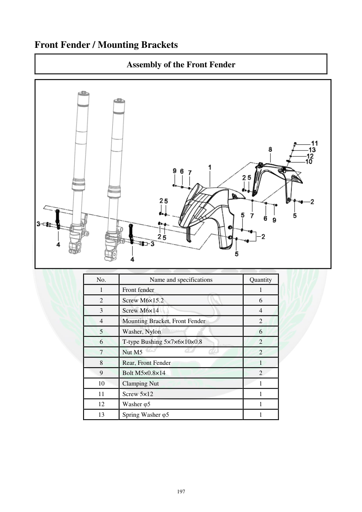

# Manual page 198

> Source: [page-0198.md](../source/page-0198.md)

## Page image / diagram

- [page-0198-img-01.png](../images/embedded/page-0198-img-01.png)

## Extracted text

# Source page 198

 
197 
Front Fender / Mounting Brackets 
Assembly of the Front Fender 
 
No. 
Name and specifications 
Quantity 
1 
Front fender 
1 
2 
Screw M6×15.2 
6 
3 
Screw M6×14 
4 
4 
Mounting Bracket, Front Fender 
2 
5 
Washer, Nylon 
6 
6 
T-type Bushing 5×7×6×10×0.8 
2 
7 
Nut M5 
2 
8 
Rear, Front Fender 
1 
9 
Bolt M5×0.8×14 
2 
10 
Clamping Nut 
1 
11 
Screw 5×12 
1 
12 
Washer φ5 
1 
13 
Spring Washer φ5 
1

## Persian notes

### اجزای گلگیر جلو و براکت‌ها
قطعات اصلی شامل گلگیر جلو، بخش عقب گلگیر، دو براکت نگهدارنده، واشرهای نایلونی و بوش‌های T شکل است. مشخصات مهم پیچ‌ها طبق جدول: **M6×15.2، M6×14، M5×0.8×14** و سایر اتصالات ثبت‌شده در صفحه. تصویر برای محل دقیق براکت‌ها مرجع است.
