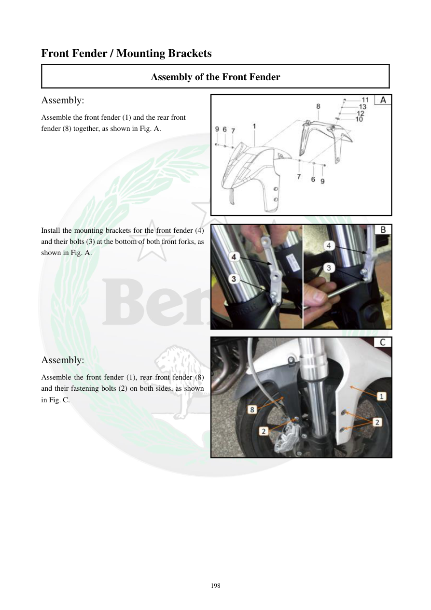

# Manual page 199

> Source: [page-0199.md](../source/page-0199.md)

## Page image / diagram

- [page-0199-img-01.jpeg](../images/embedded/page-0199-img-01.jpeg)

- [page-0199-img-02.jpeg](../images/embedded/page-0199-img-02.jpeg)

- [page-0199-img-03.jpeg](../images/embedded/page-0199-img-03.jpeg)

## Extracted text

# Source page 199

 
198 
Front Fender / Mounting Brackets 
Assembly of the Front Fender 
Assembly: 
Assemble the front fender (1) and the rear front 
fender (8) together, as shown in Fig. A. 
 
 
 
 
 
 
 
 
Install the mounting brackets for the front fender (4) 
and their bolts (3) at the bottom of both front forks, as 
shown in Fig. A. 
 
 
 
 
 
 
 
Assembly: 
Assemble the front fender (1), rear front fender (8) 
and their fastening bolts (2) on both sides, as shown 
in Fig. C.

## Persian notes

<!-- Persian translation/explanation will be added here. -->
