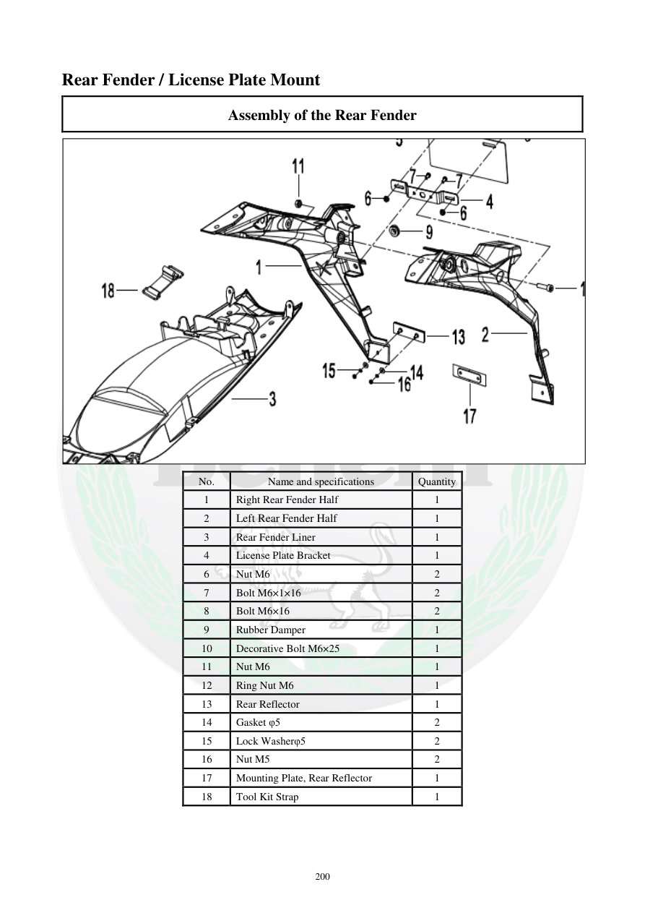

# Manual page 201

> Source: [page-0201.md](../source/page-0201.md)

## Page image / diagram

- [page-0201-img-01.png](../images/embedded/page-0201-img-01.png)

## Extracted text

# Source page 201

 
200 
Rear Fender / License Plate Mount 
Assembly of the Rear Fender 
 
No. 
Name and specifications 
Quantity 
1 
Right Rear Fender Half 
1 
2 
Left Rear Fender Half 
1 
3 
Rear Fender Liner 
1 
4 
License Plate Bracket 
1 
6 
Nut M6 
2 
7 
Bolt M6×1×16 
2 
8 
Bolt M6×16 
2 
9 
Rubber Damper 
1 
10 
Decorative Bolt M6×25 
1 
11 
Nut M6 
1 
12 
Ring Nut M6 
1 
13 
Rear Reflector 
1 
14 
Gasket φ5 
2 
15 
Lock Washerφ5 
2 
16 
Nut M5 
2 
17 
Mounting Plate, Rear Reflector 
1 
18 
Tool Kit Strap 
1

## Persian notes

<!-- Persian translation/explanation will be added here. -->
