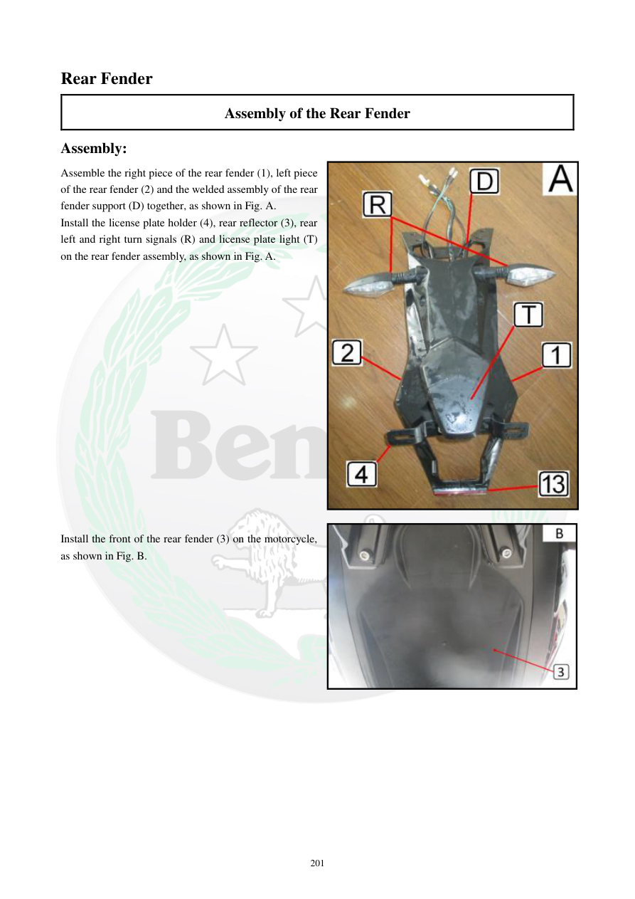

# Manual page 202

> Source: [page-0202.md](../source/page-0202.md)

## Page image / diagram

- [page-0202-img-01.jpeg](../images/embedded/page-0202-img-01.jpeg)

- [page-0202-img-02.jpeg](../images/embedded/page-0202-img-02.jpeg)

## Extracted text

# Source page 202

 
201 
Rear Fender 
Assembly of the Rear Fender 
Assembly: 
Assemble the right piece of the rear fender (1), left piece 
of the rear fender (2) and the welded assembly of the rear 
fender support (D) together, as shown in Fig. A. 
Install the license plate holder (4), rear reflector (3), rear 
left and right turn signals (R) and license plate light (T) 
on the rear fender assembly, as shown in Fig. A. 
 
 
 
 
 
 
 
 
 
 
 
 
 
 
 
 
Install the front of the rear fender (3) on the motorcycle, 
as shown in Fig. B.

## Persian notes

### مونتاژ گلگیر عقب
- نیمه راست **1**، نیمه چپ **2** و مجموعه جوش‌شده نگهدارنده گلگیر **D** به هم متصل شوند.
- پایه پلاک **4**، رفلکتور عقب **3**، راهنماهای عقب راست و چپ **R** و چراغ پلاک **T** روی مجموعه گلگیر نصب شوند.
- قسمت جلویی گلگیر عقب روی موتور نصب شود. محل دقیق قطعات با تصاویر صفحه کنترل شود.
