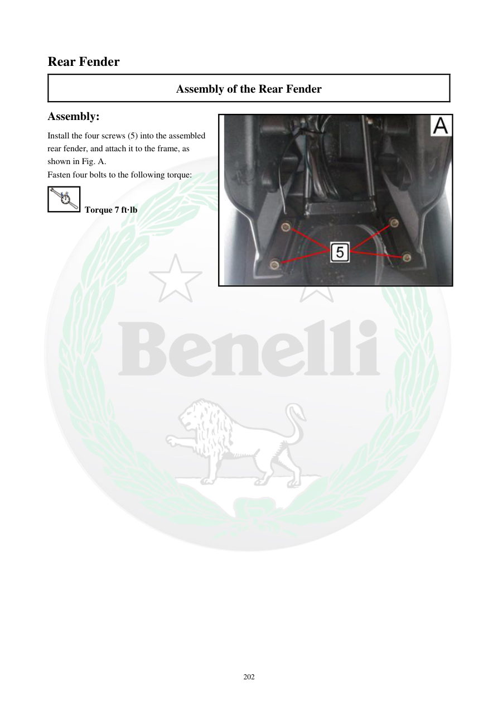

# Manual page 203

> Source: [page-0203.md](../source/page-0203.md)

## Page image / diagram

- [page-0203-img-02.jpeg](../images/embedded/page-0203-img-02.jpeg)

## Extracted text

# Source page 203

 
202 
Rear Fender 
Assembly of the Rear Fender 
Assembly: 
Install the four screws (5) into the assembled 
rear fender, and attach it to the frame, as 
shown in Fig. A. 
Fasten four bolts to the following torque: 
 Torque 7 ft·lb

## Persian notes

<!-- Persian translation/explanation will be added here. -->
