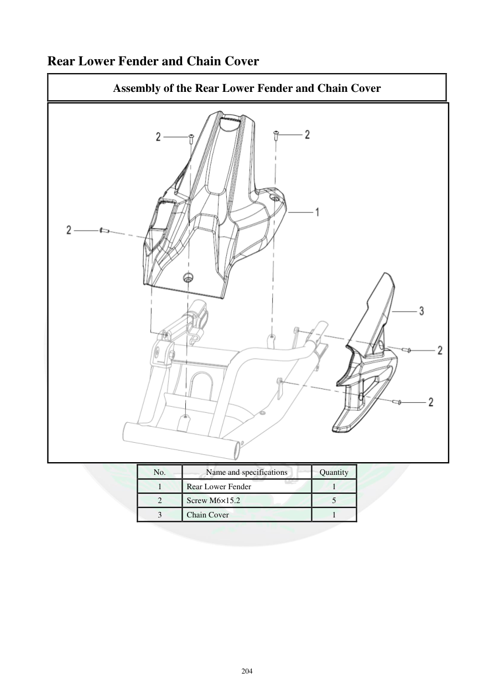

# Manual page 205

> Source: [page-0205.md](../source/page-0205.md)

## Page image / diagram

- [page-0205-img-02.png](../images/embedded/page-0205-img-02.png)

## Extracted text

# Source page 205

 
204 
Rear Lower Fender and Chain Cover 
Assembly of the Rear Lower Fender and Chain Cover 
 
No. 
Name and specifications 
Quantity 
1 
Rear Lower Fender 
1 
2 
Screw M6×15.2 
5 
3 
Chain Cover 
1

## Persian notes

### اجزای گلگیر پایین عقب و قاب زنجیر
مجموعه شامل گلگیر پایین عقب **1**، پنج پیچ **M6×15.2** و قاب زنجیر **3** است.
