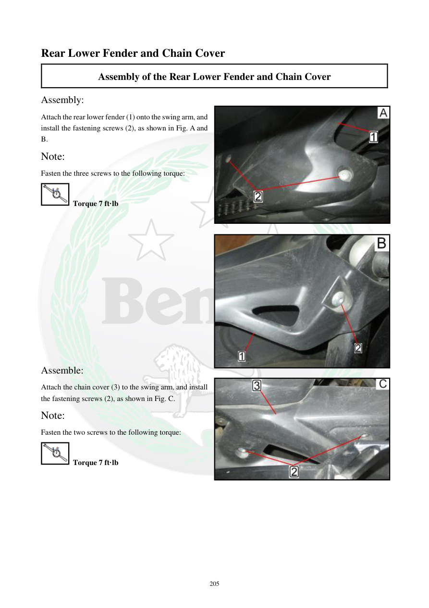

# Manual page 206

> Source: [page-0206.md](../source/page-0206.md)

## Page image / diagram

- [page-0206-img-02.jpeg](../images/embedded/page-0206-img-02.jpeg)

- [page-0206-img-03.jpeg](../images/embedded/page-0206-img-03.jpeg)

- [page-0206-img-04.jpeg](../images/embedded/page-0206-img-04.jpeg)

## Extracted text

# Source page 206

 
205 
Rear Lower Fender and Chain Cover 
Assembly of the Rear Lower Fender and Chain Cover 
Assembly: 
Attach the rear lower fender (1) onto the swing arm, and 
install the fastening screws (2), as shown in Fig. A and 
B. 
Note: 
Fasten the three screws to the following torque: 
 Torque 7 ft·lb 
 
 
 
 
 
 
 
 
 
 
 
 
 
Assemble: 
Attach the chain cover (3) to the swing arm, and install 
the fastening screws (2), as shown in Fig. C. 
Note: 
Fasten the two screws to the following torque: 
 Torque 7 ft·lb

## Persian notes

### نصب گلگیر پایین عقب و قاب زنجیر
- گلگیر پایین عقب **1** روی بازوی نوسان نصب و سه پیچ **2** بسته شوند؛ گشتاور: **7 ft·lb**.
- قاب زنجیر **3** روی بازوی نوسان نصب و دو پیچ **2** بسته شوند؛ گشتاور: **7 ft·lb**.
