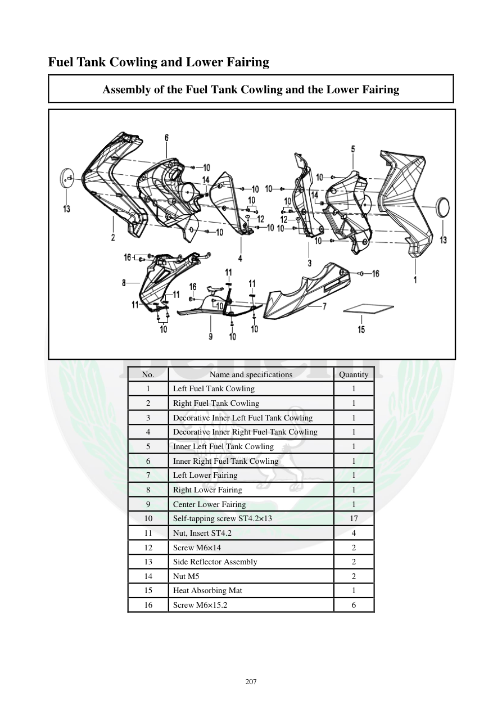

# Manual page 208

> Source: [page-0208.md](../source/page-0208.md)

## Page image / diagram

- [page-0208-img-01.png](../images/embedded/page-0208-img-01.png)

## Extracted text

# Source page 208

 
207 
Fuel Tank Cowling and Lower Fairing 
Assembly of the Fuel Tank Cowling and the Lower Fairing 
 
No. 
Name and specifications 
Quantity 
1 
Left Fuel Tank Cowling 
1 
2 
Right Fuel Tank Cowling 
1 
3 
Decorative Inner Left Fuel Tank Cowling 
1 
4 
Decorative Inner Right Fuel Tank Cowling 
1 
5 
Inner Left Fuel Tank Cowling 
1 
6 
Inner Right Fuel Tank Cowling 
1 
7 
Left Lower Fairing 
1 
8 
Right Lower Fairing 
1 
9 
Center Lower Fairing 
1 
10 
Self-tapping screw ST4.2×13 
17 
11 
Nut, Insert ST4.2 
4 
12 
Screw M6×14 
2 
13 
Side Reflector Assembly 
2 
14 
Nut M5 
2 
15 
Heat Absorbing Mat 
1 
16 
Screw M6×15.2 
6

## Persian notes

### اجزای کاول باک و فلاپینگ پایین
مجموعه شامل کاول چپ و راست باک، کاول‌های داخلی و تزئینی، فلاپینگ پایین چپ/راست/مرکزی، رفلکتورهای جانبی و عایق حرارتی است. پیچ‌های مهم: **ST4.2×13، M6×14 و M6×15.2**.
