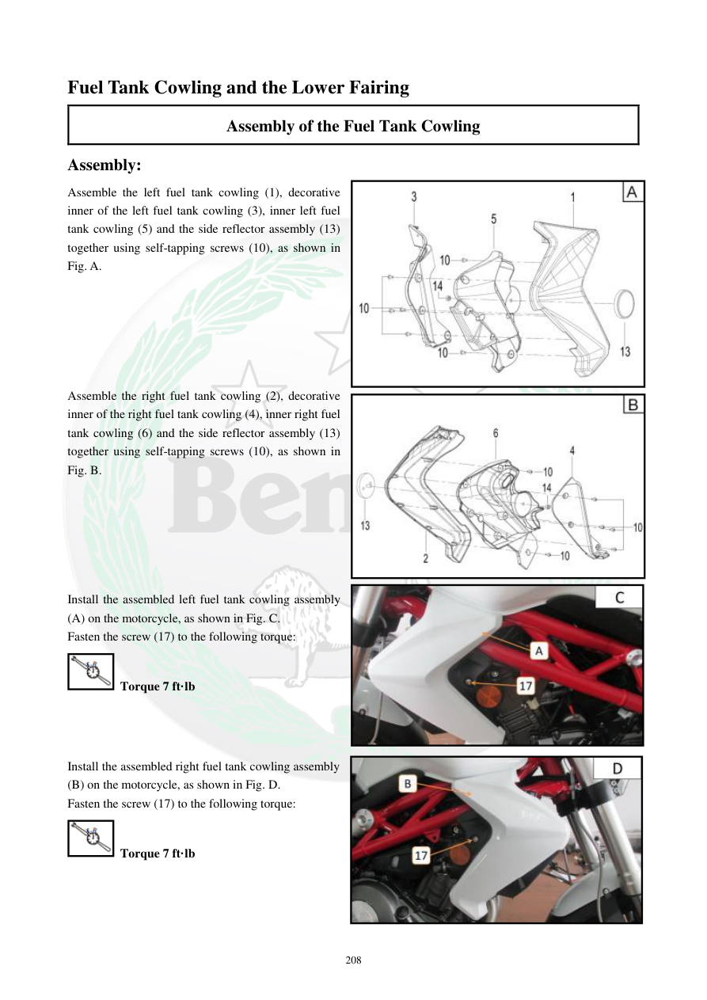

# Manual page 209

> Source: [page-0209.md](../source/page-0209.md)

## Page image / diagram

- [page-0209-img-02.jpeg](../images/embedded/page-0209-img-02.jpeg)

- [page-0209-img-03.jpeg](../images/embedded/page-0209-img-03.jpeg)

- [page-0209-img-04.jpeg](../images/embedded/page-0209-img-04.jpeg)

- [page-0209-img-05.jpeg](../images/embedded/page-0209-img-05.jpeg)

## Extracted text

# Source page 209

 
208 
Fuel Tank Cowling and the Lower Fairing 
Assembly of the Fuel Tank Cowling  
Assembly: 
Assemble the left fuel tank cowling (1), decorative 
inner of the left fuel tank cowling (3), inner left fuel 
tank cowling (5) and the side reflector assembly (13) 
together using self-tapping screws (10), as shown in 
Fig. A. 
 
 
 
 
 
 
Assemble the right fuel tank cowling (2), decorative 
inner of the right fuel tank cowling (4), inner right fuel 
tank cowling (6) and the side reflector assembly (13) 
together using self-tapping screws (10), as shown in 
Fig. B. 
 
 
 
 
 
 
Install the assembled left fuel tank cowling assembly 
(A) on the motorcycle, as shown in Fig. C. 
Fasten the screw (17) to the following torque: 
 Torque 7 ft·lb 
 
 
 
Install the assembled right fuel tank cowling assembly 
(B) on the motorcycle, as shown in Fig. D. 
Fasten the screw (17) to the following torque: 
 Torque 7 ft·lb

## Persian notes

<!-- Persian translation/explanation will be added here. -->
