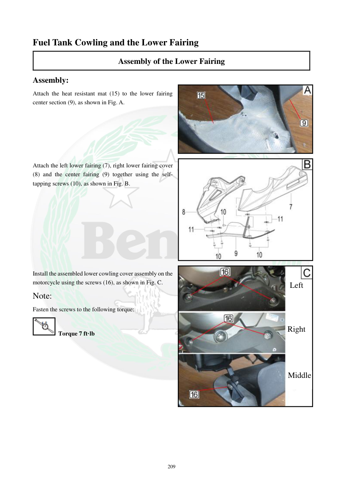

# Manual page 210

> Source: [page-0210.md](../source/page-0210.md)

## Page image / diagram

- [page-0210-img-02.jpeg](../images/embedded/page-0210-img-02.jpeg)

- [page-0210-img-03.jpeg](../images/embedded/page-0210-img-03.jpeg)

- [page-0210-img-04.jpeg](../images/embedded/page-0210-img-04.jpeg)

## Extracted text

# Source page 210

 
209 
Fuel Tank Cowling and the Lower Fairing 
Assembly of the Lower Fairing 
Assembly: 
Attach the heat resistant mat (15) to the lower fairing 
center section (9), as shown in Fig. A. 
 
 
 
 
 
 
Attach the left lower fairing (7), right lower fairing cover 
(8) and the center fairing (9) together using the self-
tapping screws (10), as shown in Fig. B. 
 
 
 
 
 
 
 
 
 
Install the assembled lower cowling cover assembly on the 
motorcycle using the screws (16), as shown in Fig. C. 
Note: 
Fasten the screws to the following torque: 
 Torque 7 ft·lb 
 
 
 Left  
Right 
Middle

## Persian notes

### مونتاژ فلاپینگ پایین
- عایق حرارتی **15** به بخش مرکزی فلاپینگ **9** متصل شود.
- فلاپینگ پایین چپ **7**، راست **8** و مرکزی **9** با پیچ‌های خودکار **10** به هم متصل شوند.
- مجموعه روی موتور با پیچ‌های **16** نصب شود.
- گشتاور پیچ‌ها: **7 ft·lb**.
