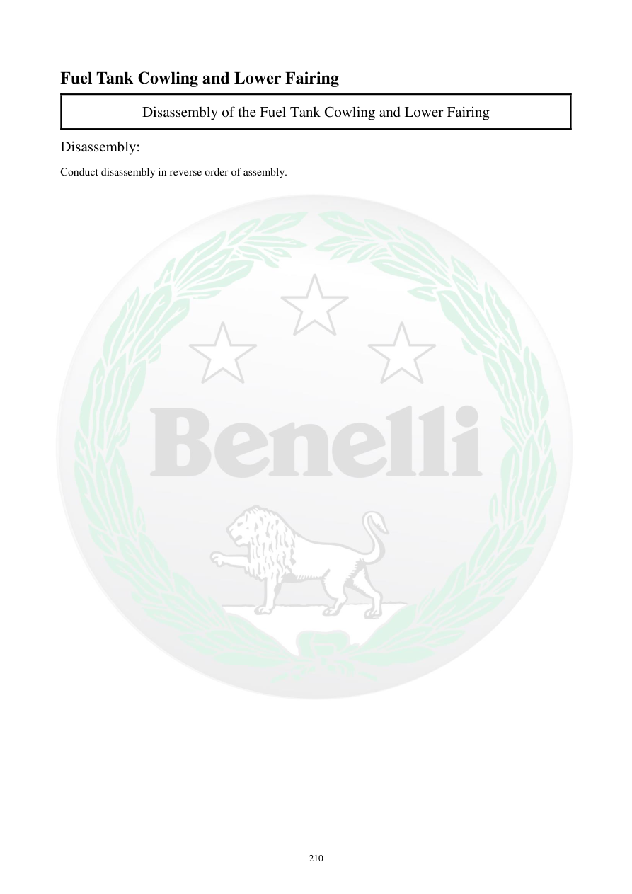

# Manual page 211

> Source: [page-0211.md](../source/page-0211.md)

## Page image / diagram

## Extracted text

# Source page 211

 
210 
Fuel Tank Cowling and Lower Fairing 
Disassembly of the Fuel Tank Cowling and Lower Fairing 
Disassembly: 
Conduct disassembly in reverse order of assembly.

## Persian notes

### بازکردن کاول باک و فلاپینگ پایین
- بازکردن طبق ترتیب معکوس مونتاژ انجام شود.
