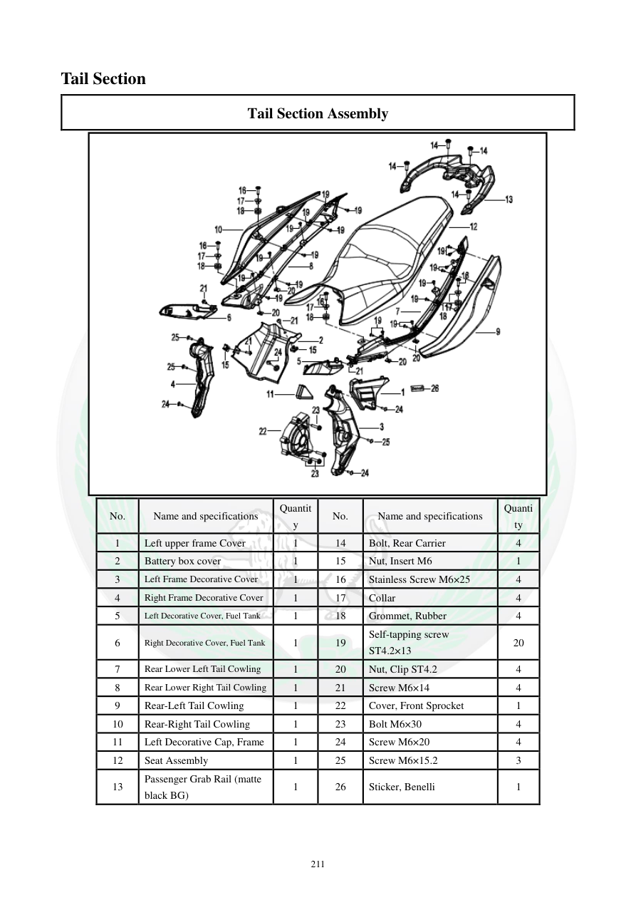

# Manual page 212

> Source: [page-0212.md](../source/page-0212.md)

## Page image / diagram

- [page-0212-img-01.png](../images/embedded/page-0212-img-01.png)

## Extracted text

# Source page 212

 
211 
Tail Section 
Tail Section Assembly 
 
No. 
Name and specifications 
Quantit
y 
No. 
Name and specifications 
Quanti
ty 
1 
Left upper frame Cover 
1 
14 
Bolt, Rear Carrier 
4 
2 
Battery box cover 
1 
15 
Nut, Insert M6 
1 
3 
Left Frame Decorative Cover 
1 
16 
Stainless Screw M6×25 
4 
4 
Right Frame Decorative Cover 
1 
17 
Collar 
4 
5 
Left Decorative Cover, Fuel Tank 
1 
18 
Grommet, Rubber 
4 
6 
Right Decorative Cover, Fuel Tank 
1 
19 
Self-tapping screw 
ST4.2×13 
20 
7 
Rear Lower Left Tail Cowling 
1 
20 
Nut, Clip ST4.2 
4 
8 
Rear Lower Right Tail Cowling 
1 
21 
Screw M6×14 
4 
9 
Rear-Left Tail Cowling 
1 
22 
Cover, Front Sprocket 
1 
10 
Rear-Right Tail Cowling 
1 
23 
Bolt M6×30 
4 
11 
Left Decorative Cap, Frame 
1 
24 
Screw M6×20 
4 
12 
Seat Assembly 
1 
25 
Screw M6×15.2 
3 
13 
Passenger Grab Rail (matte 
black BG) 
1 
26 
Sticker, Benelli  
1

## Persian notes

### اجزای بخش عقب بدنه
فهرست قطعات شامل پوشش‌های فریم، کاول‌های دم عقب، صندلی، دستگیره سرنشین، پوشش چرخ‌دنده جلو و مجموعه پیچ و مهره‌هاست. مشخصات مهم شامل پیچ‌های **M6×25، M6×14، M6×30، M6×20 و M6×15.2** و پیچ خودکار **ST4.2×13** است.
