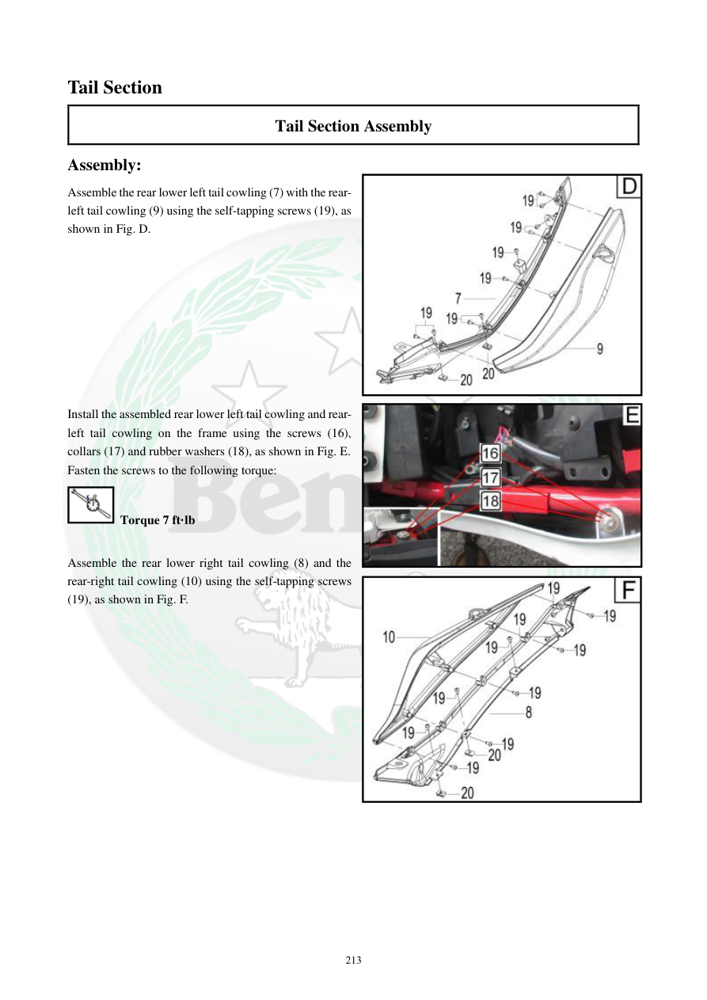

# Manual page 214

> Source: [page-0214.md](../source/page-0214.md)

## Page image / diagram

- [page-0214-img-02.jpeg](../images/embedded/page-0214-img-02.jpeg)

- [page-0214-img-03.jpeg](../images/embedded/page-0214-img-03.jpeg)

- [page-0214-img-04.jpeg](../images/embedded/page-0214-img-04.jpeg)

## Extracted text

# Source page 214

 
213 
Tail Section 
Tail Section Assembly 
Assembly: 
Assemble the rear lower left tail cowling (7) with the rear-
left tail cowling (9) using the self-tapping screws (19), as 
shown in Fig. D. 
 
 
 
 
 
 
 
 
 
Install the assembled rear lower left tail cowling and rear-
left tail cowling on the frame using the screws (16), 
collars (17) and rubber washers (18), as shown in Fig. E. 
Fasten the screws to the following torque: 
 Torque 7 ft·lb 
 
Assemble the rear lower right tail cowling (8) and the 
rear-right tail cowling (10) using the self-tapping screws 
(19), as shown in Fig. F.

## Persian notes

<!-- Persian translation/explanation will be added here. -->
