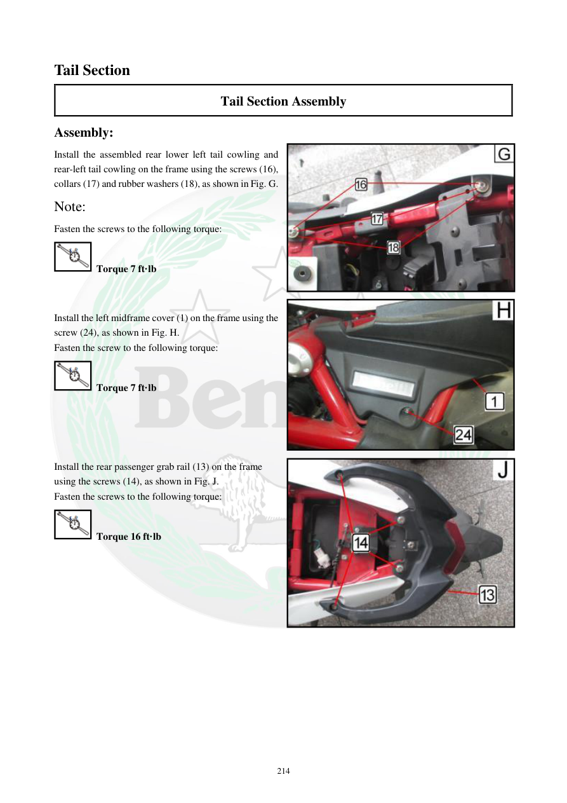

# Manual page 215

> Source: [page-0215.md](../source/page-0215.md)

## Page image / diagram

- [page-0215-img-02.jpeg](../images/embedded/page-0215-img-02.jpeg)

- [page-0215-img-03.jpeg](../images/embedded/page-0215-img-03.jpeg)

- [page-0215-img-04.jpeg](../images/embedded/page-0215-img-04.jpeg)

## Extracted text

# Source page 215

 
214 
Tail Section 
Tail Section Assembly 
Assembly: 
Install the assembled rear lower left tail cowling and 
rear-left tail cowling on the frame using the screws (16), 
collars (17) and rubber washers (18), as shown in Fig. G. 
Note: 
Fasten the screws to the following torque: 
 Torque 7 ft·lb 
 
 
Install the left midframe cover (1) on the frame using the 
screw (24), as shown in Fig. H. 
Fasten the screw to the following torque: 
 Torque 7 ft·lb 
 
 
 
 
Install the rear passenger grab rail (13) on the frame  
using the screws (14), as shown in Fig. J. 
Fasten the screws to the following torque: 
 Torque 16 ft·lb

## Persian notes

### تکمیل مونتاژ بخش عقب
- مجموعه کاول‌های سمت چپ با پیچ‌های **16**، Collarهای **17** و واشرهای لاستیکی **18** روی فریم نصب شود؛ گشتاور **7 ft·lb**.
- پوشش میانی چپ فریم **1** با پیچ **24** نصب شود؛ گشتاور **7 ft·lb**.
- دستگیره سرنشین **13** با پیچ‌های **14** نصب شود؛ گشتاور **16 ft·lb**.
