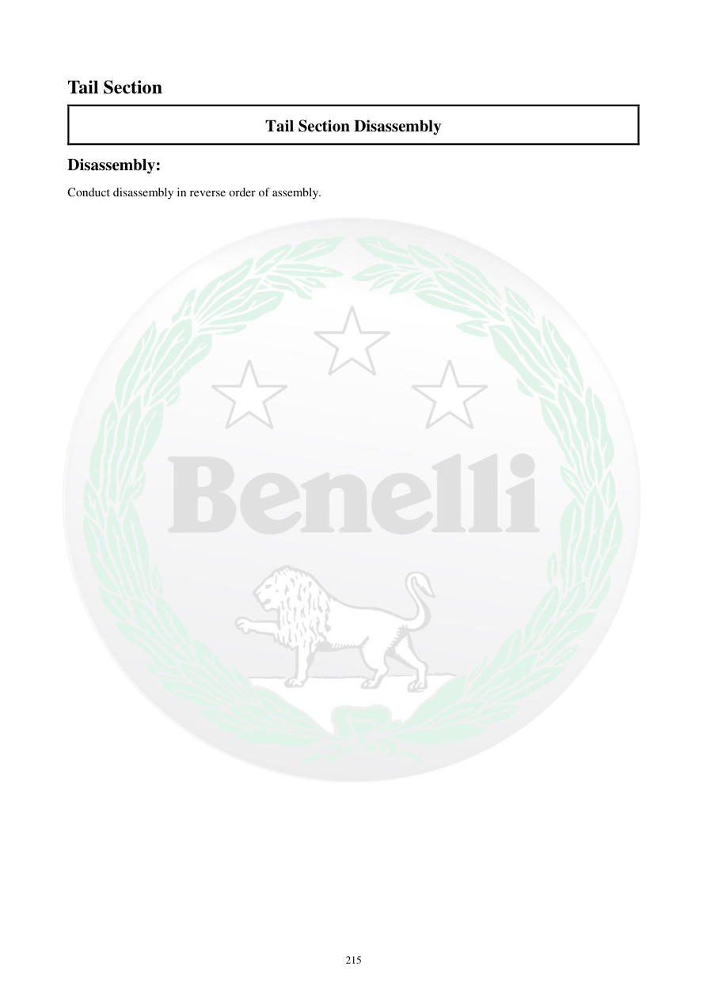

# Manual page 216

> Source: [page-0216.md](../source/page-0216.md)

## Page image / diagram

## Extracted text

# Source page 216

 
215 
Tail Section 
Tail Section Disassembly 
Disassembly: 
Conduct disassembly in reverse order of assembly.

## Persian notes

<!-- Persian translation/explanation will be added here. -->
