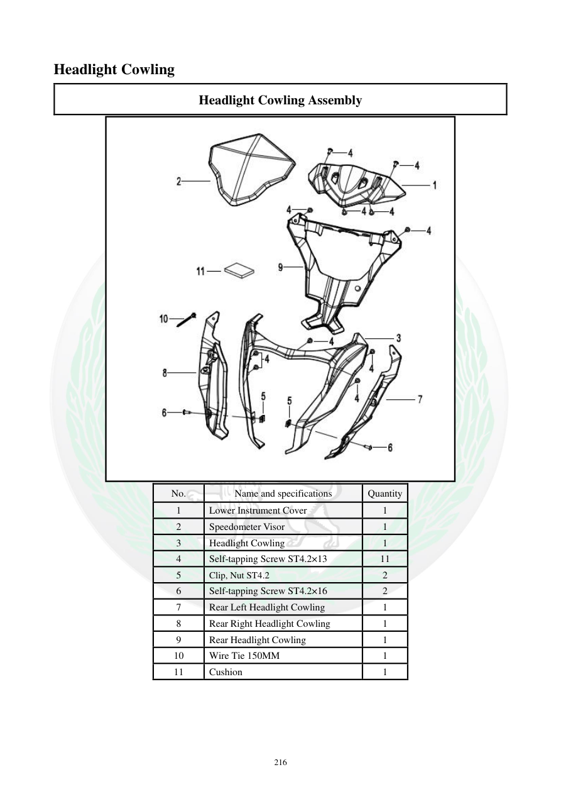

# Manual page 217

> Source: [page-0217.md](../source/page-0217.md)

## Page image / diagram

- [page-0217-img-01.jpeg](../images/embedded/page-0217-img-01.jpeg)

## Extracted text

# Source page 217

 
216 
Headlight Cowling 
Headlight Cowling Assembly 
 
No. 
Name and specifications 
Quantity 
1 
Lower Instrument Cover 
1 
2 
Speedometer Visor 
1 
3 
Headlight Cowling 
1 
4 
Self-tapping Screw ST4.2×13 
11 
5 
Clip, Nut ST4.2 
2 
6 
Self-tapping Screw ST4.2×16 
2 
7 
Rear Left Headlight Cowling 
1 
8 
Rear Right Headlight Cowling 
1 
9 
Rear Headlight Cowling 
1 
10 
Wire Tie 150MM 
1 
11 
Cushion 
1

## Persian notes

<!-- Persian translation/explanation will be added here. -->
