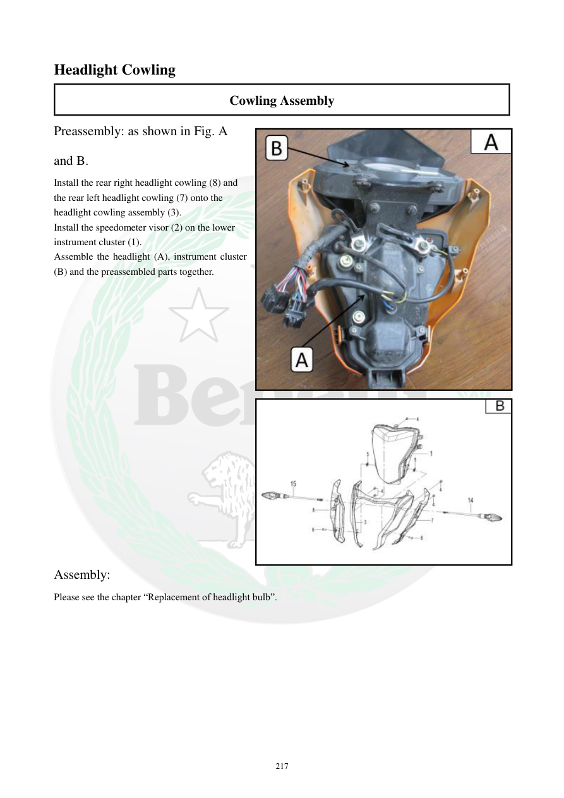

# Manual page 218

> Source: [page-0218.md](../source/page-0218.md)

## Page image / diagram

- [page-0218-img-01.jpeg](../images/embedded/page-0218-img-01.jpeg)

- [page-0218-img-02.jpeg](../images/embedded/page-0218-img-02.jpeg)

## Extracted text

# Source page 218

 
217 
Headlight Cowling 
Cowling Assembly 
Preassembly: as shown in Fig. A 
and B. 
Install the rear right headlight cowling (8) and 
the rear left headlight cowling (7) onto the 
headlight cowling assembly (3). 
Install the speedometer visor (2) on the lower 
instrument cluster (1). 
Assemble the headlight (A), instrument cluster 
(B) and the preassembled parts together. 
 
 
 
 
 
 
 
 
 
 
 
 
 
 
 
 
 
 
 
Assembly: 
Please see the chapter “Replacement of headlight bulb”.

## Persian notes

### مونتاژ کاول چراغ جلو
- کاول عقب راست **8** و عقب چپ **7** روی مجموعه کاول چراغ جلو **3** نصب شوند.
- آفتاب‌گیر کیلومتر **2** روی مجموعه پایین کیلومتر **1** نصب شود.
- چراغ جلو **A**، مجموعه کیلومتر **B** و قطعات پیش‌مونتاژشده با هم مونتاژ شوند.
- برای جزئیات مربوط به خود چراغ، دفترچه به بخش **Replacement of headlight bulb** ارجاع می‌دهد.
