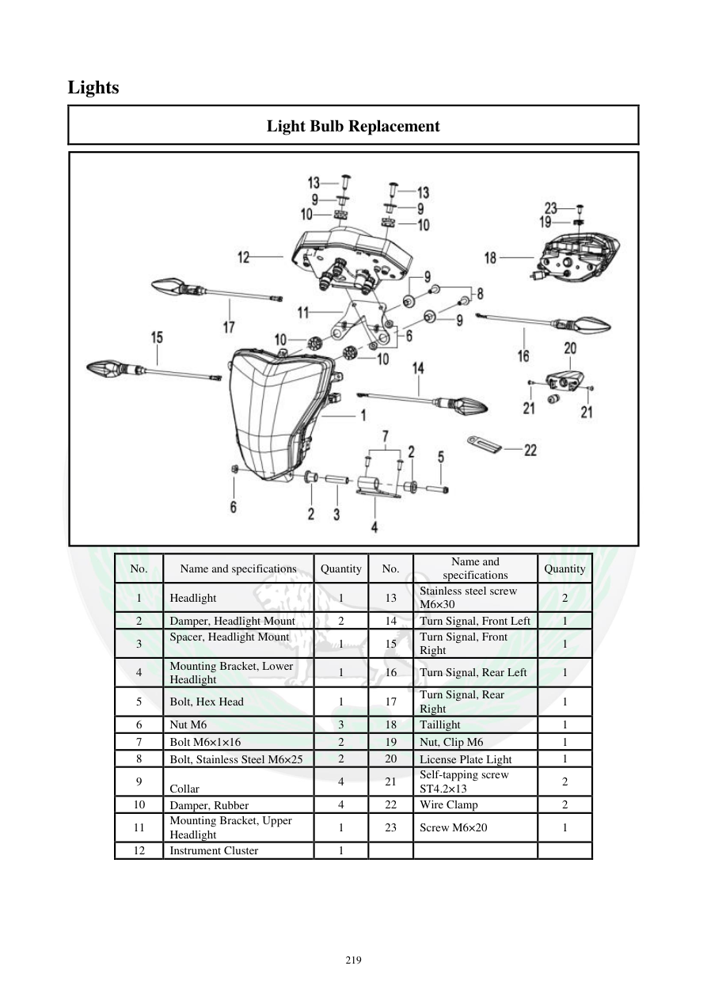

# Manual page 220

> Source: [page-0220.md](../source/page-0220.md)

## Page image / diagram

- [page-0220-img-01.jpeg](../images/embedded/page-0220-img-01.jpeg)

## Extracted text

# Source page 220

 
219 
Lights  
Light Bulb Replacement   
 
No. 
Name and specifications  
Quantity 
No. 
Name and 
specifications  
Quantity 
1 
Headlight  
1 
13 
Stainless steel screw 
M6×30 
2 
2 
Damper, Headlight Mount  
2 
14 
Turn Signal, Front Left  
1 
3 
Spacer, Headlight Mount 
  
1 
15 
Turn Signal, Front 
Right  
1 
4 
Mounting Bracket, Lower 
Headlight 
1 
16 
Turn Signal, Rear Left  
1 
5 
Bolt, Hex Head 
1 
17 
Turn Signal, Rear 
Right  
1 
6 
Nut M6 
3 
18 
Taillight  
1 
7 
Bolt M6×1×16 
2 
19 
Nut, Clip M6 
1 
8 
Bolt, Stainless Steel M6×25 
2 
20 
License Plate Light 
1 
9 
Collar  
4 
21 
Self-tapping screw 
ST4.2×13 
2 
10 
Damper, Rubber  
4 
22 
Wire Clamp  
2 
11 
Mounting Bracket, Upper 
Headlight 
1 
23 
Screw M6×20 
1 
12 
Instrument Cluster  
1

## Persian notes

<!-- Persian translation/explanation will be added here. -->
