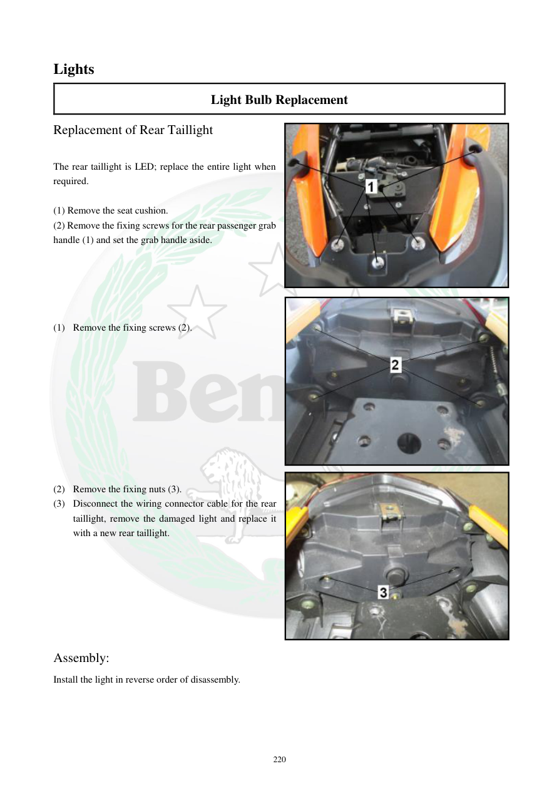

# Manual page 221

> Source: [page-0221.md](../source/page-0221.md)

## Page image / diagram

- [page-0221-img-01.jpeg](../images/embedded/page-0221-img-01.jpeg)

- [page-0221-img-02.jpeg](../images/embedded/page-0221-img-02.jpeg)

- [page-0221-img-03.jpeg](../images/embedded/page-0221-img-03.jpeg)

## Extracted text

# Source page 221

 
220 
Lights 
Light Bulb Replacement   
Replacement of Rear Taillight 
 
The rear taillight is LED; replace the entire light when 
required.  
 
(1) Remove the seat cushion.  
(2) Remove the fixing screws for the rear passenger grab 
handle (1) and set the grab handle aside.  
 
 
 
 
 
(1) Remove the fixing screws (2).  
 
 
 
 
 
 
 
 
 
 
(2) Remove the fixing nuts (3).  
(3) Disconnect the wiring connector cable for the rear 
taillight, remove the damaged light and replace it 
with a new rear taillight.  
 
 
 
 
 
 
 
Assembly:  
Install the light in reverse order of disassembly.

## Persian notes

### تعویض چراغ عقب
- چراغ عقب **LED** است و در صورت خرابی باید **کل مجموعه چراغ** تعویض شود.
- زین را باز کنید و پیچ‌های دستگیره سرنشین را باز کنید.
- پیچ‌های **2** و سپس مهره‌های **3** را باز کنید.
- کانکتور سیم چراغ عقب را جدا کرده، چراغ معیوب را خارج و چراغ جدید را نصب کنید.
- مونتاژ در ترتیب معکوس بازکردن انجام شود.
