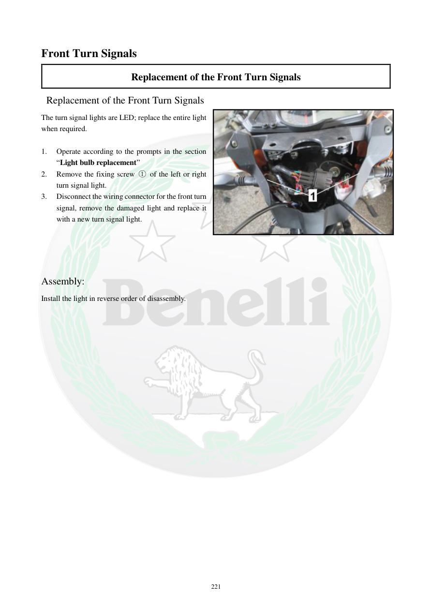

# Manual page 222

> Source: [page-0222.md](../source/page-0222.md)

## Page image / diagram

- [page-0222-img-01.jpeg](../images/embedded/page-0222-img-01.jpeg)

## Extracted text

# Source page 222

 
221 
Front Turn Signals  
Replacement of the Front Turn Signals  
 Replacement of the Front Turn Signals  
The turn signal lights are LED; replace the entire light 
when required.  
 
1. 
Operate according to the prompts in the section 
“Light bulb replacement” 
2. 
Remove the fixing screw ① of the left or right 
turn signal light.  
3. 
Disconnect the wiring connector for the front turn 
signal, remove the damaged light and replace it 
with a new turn signal light.  
 
 
 
 
Assembly:  
Install the light in reverse order of disassembly.

## Persian notes

### تعویض راهنمای جلو
- راهنماهای جلو **LED** هستند و در صورت خرابی باید کل مجموعه راهنما تعویض شود.
- طبق بخش تعویض لامپ چراغ‌ها عمل کنید.
- پیچ نگهدارنده **①** راهنمای چپ یا راست را باز کنید.
- کانکتور سیم راهنما را جدا کرده و راهنمای معیوب را تعویض کنید.
- مونتاژ در ترتیب معکوس بازکردن انجام شود.
