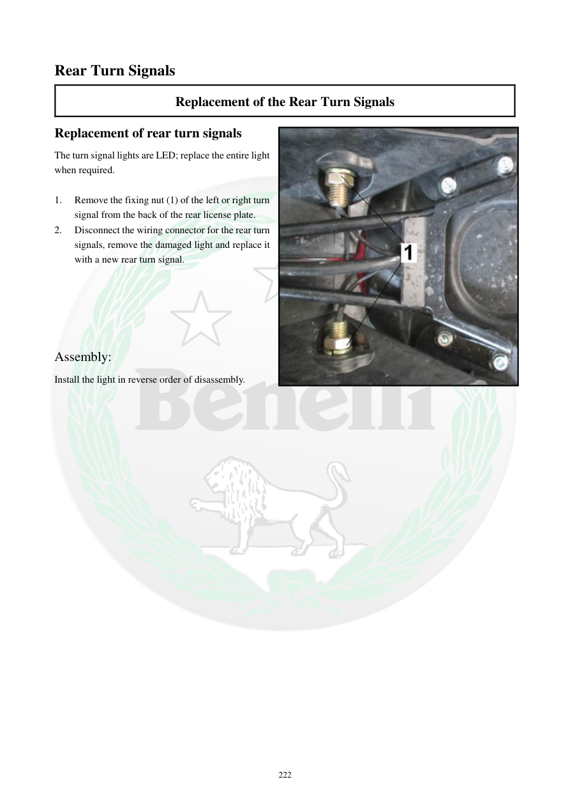

# Manual page 223

> Source: [page-0223.md](../source/page-0223.md)

## Page image / diagram

- [page-0223-img-01.jpeg](../images/embedded/page-0223-img-01.jpeg)

## Extracted text

# Source page 223

 
222 
Rear Turn Signals 
Replacement of the Rear Turn Signals 
Replacement of rear turn signals 
The turn signal lights are LED; replace the entire light 
when required.  
 
1. 
Remove the fixing nut (1) of the left or right turn 
signal from the back of the rear license plate.  
2. 
Disconnect the wiring connector for the rear turn 
signals, remove the damaged light and replace it 
with a new rear turn signal. 
 
 
 
 
 
 
Assembly:  
Install the light in reverse order of disassembly.

## Persian notes

<!-- Persian translation/explanation will be added here. -->
