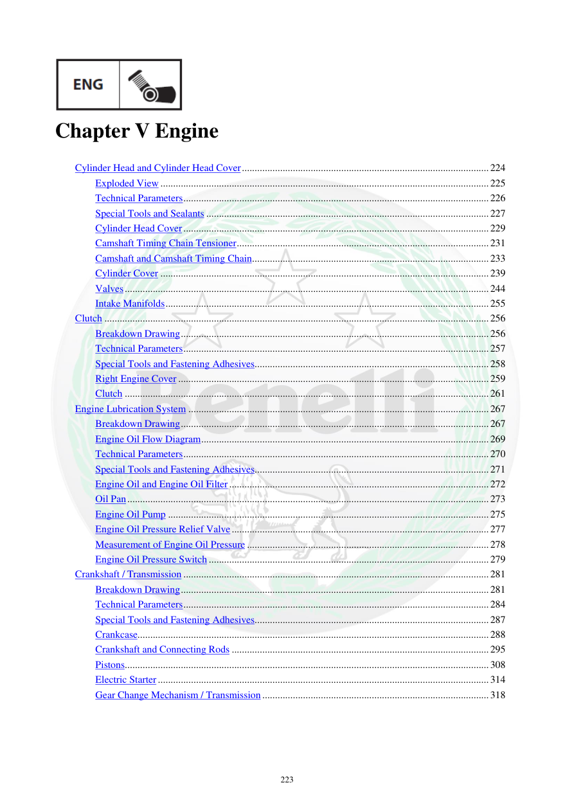

# Manual page 224

> Source: [page-0224.md](../source/page-0224.md)

## Page image / diagram

## Extracted text

# Source page 224

 
223 
 
Chapter V Engine 
 
Cylinder Head and Cylinder Head Cover ................................................................................................. 224 
Exploded View ................................................................................................................................. 225 
Technical Parameters ........................................................................................................................ 226 
Special Tools and Sealants ............................................................................................................... 227 
Cylinder Head Cover ........................................................................................................................ 229 
Camshaft Timing Chain Tensioner ................................................................................................... 231 
Camshaft and Camshaft Timing Chain ............................................................................................. 233 
Cylinder Cover ................................................................................................................................. 239 
Valves ............................................................................................................................................... 244 
Intake Manifolds ............................................................................................................................... 255 
Clutch ....................................................................................................................................................... 256 
Breakdown Drawing ......................................................................................................................... 256 
Technical Parameters ........................................................................................................................ 257 
Special Tools and Fastening Adhesives............................................................................................ 258 
Right Engine Cover .......................................................................................................................... 259 
Clutch ............................................................................................................................................... 261 
Engine Lubrication System ...................................................................................................................... 267 
Breakdown Drawing ......................................................................................................................... 267 
Engine Oil Flow Diagram ................................................................................................................. 269 
Technical Parameters ........................................................................................................................ 270 
Special Tools and Fastening Adhesives............................................................................................ 271 
Engine Oil and Engine Oil Filter ...................................................................................................... 272 
Oil Pan .............................................................................................................................................. 273 
Engine Oil Pump .............................................................................................................................. 275 
Engine Oil Pressure Relief Valve ..................................................................................................... 277 
Measurement of Engine Oil Pressure ............................................................................................... 278 
Engine Oil Pressure Switch .............................................................................................................. 279 
Crankshaft / Transmission ........................................................................................................................ 281 
Breakdown Drawing ......................................................................................................................... 281 
Technical Parameters ........................................................................................................................ 284 
Special Tools and Fastening Adhesives............................................................................................ 287 
Crankcase.......................................................................................................................................... 288 
Crankshaft and Connecting Rods ..................................................................................................... 295 
Pistons ............................................................................................................................................... 308 
Electric Starter .................................................................................................................................. 314 
Gear Change Mechanism / Transmission ......................................................................................... 318

## Persian notes

<!-- Persian translation/explanation will be added here. -->
