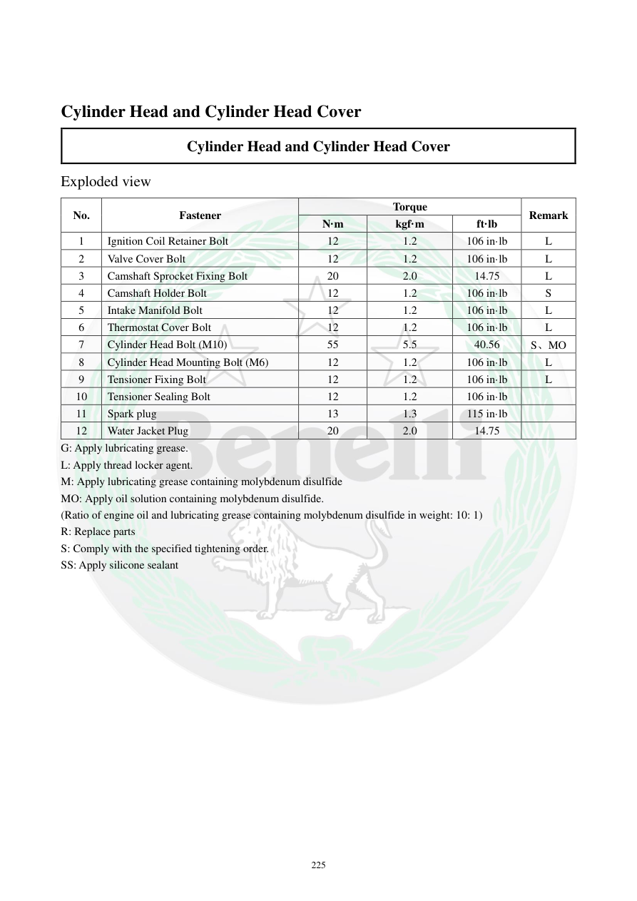

# Manual page 226

> Source: [page-0226.md](../source/page-0226.md)

## Page image / diagram

## Extracted text

# Source page 226

 
225 
 
Cylinder Head and Cylinder Head Cover 
Cylinder Head and Cylinder Head Cover 
Exploded view 
No. 
Fastener 
Torque 
Remark 
N·m 
kgf·m 
ft·lb 
1 
Ignition Coil Retainer Bolt 
12 
1.2 
106 in·lb 
L 
2 
Valve Cover Bolt 
12 
1.2 
106 in·lb 
L 
3 
Camshaft Sprocket Fixing Bolt 
20 
2.0 
14.75 
L 
4 
Camshaft Holder Bolt 
12 
1.2 
106 in·lb 
S 
5 
Intake Manifold Bolt 
12 
1.2 
106 in·lb 
L 
6 
Thermostat Cover Bolt 
12 
1.2 
106 in·lb 
L 
7 
Cylinder Head Bolt (M10) 
55 
5.5 
40.56 
S、MO 
8 
Cylinder Head Mounting Bolt (M6) 
12 
1.2 
106 in·lb 
L 
9 
Tensioner Fixing Bolt 
12 
1.2 
106 in·lb 
L 
10 
Tensioner Sealing Bolt 
12 
1.2 
106 in·lb 
 
11 
Spark plug 
13 
1.3 
115 in·lb 
 
12 
Water Jacket Plug 
20 
2.0 
14.75 
 
G: Apply lubricating grease. 
L: Apply thread locker agent. 
M: Apply lubricating grease containing molybdenum disulfide 
MO: Apply oil solution containing molybdenum disulfide. 
(Ratio of engine oil and lubricating grease containing molybdenum disulfide in weight: 10: 1) 
R: Replace parts 
S: Comply with the specified tightening order. 
SS: Apply silicone sealant

## Persian notes

### جدول گشتاورهای سرسیلندر و درپوش
- پیچ نگهدارنده کویل، پیچ درپوش سوپاپ و پیچ نگهدارنده میل‌سوپاپ: **12 N·m = 1.2 kgf·m = 106 in·lb**.
- پیچ چرخ‌دنده میل‌سوپاپ: **20 N·m = 2.0 kgf·m = 14.75 ft·lb**.
- پیچ سرسیلندر **M10**: **55 N·m = 5.5 kgf·m = 40.56 ft·lb**.
- پیچ نصب سرسیلندر **M6**: **12 N·m = 106 in·lb**.
- پیچ‌های تنشنر: **12 N·m = 106 in·lb**.
- شمع: **13 N·m = 115 in·lb**.
- پلاگ Water Jacket: **20 N·m = 14.75 ft·lb**.
- کدهای مواد: **L** thread locker، **G** گریس، **M/MO** ترکیبات حاوی مولیبدن، **R** تعویض قطعه و **S** رعایت ترتیب سفت‌کردن. نسبت مخلوط روغن موتور و گریس مولیبدن‌دار برای **MO** برابر **10:1 وزنی** ذکر شده است.
