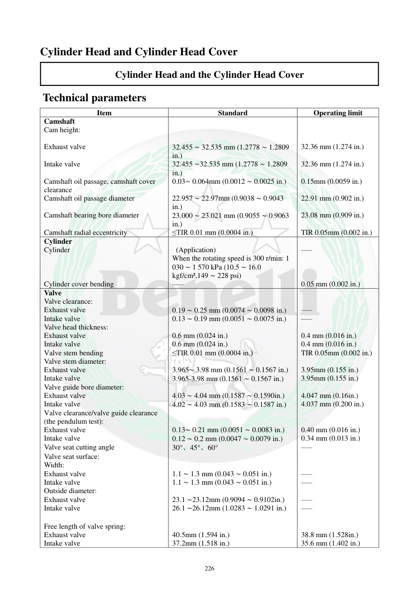

# Manual page 227

> Source: [page-0227.md](../source/page-0227.md)

## Page image / diagram

## Extracted text

# Source page 227

 
226 
Cylinder Head and Cylinder Head Cover 
Cylinder Head and the Cylinder Head Cover 
 Technical parameters 
Item 
Standard 
Operating limit  
Camshaft 
 
 
Cam height: 
 
 
 
Exhaust valve 
32.455 ∼ 32.535 mm (1.2778 ∼ 1.2809 
in.) 
32.36 mm (1.274 in.) 
Intake valve 
 
32.455 ∼32.535 mm (1.2778 ∼ 1.2809 
in.) 
32.36 mm (1.274 in.) 
Camshaft oil passage, camshaft cover 
clearance 
0.03∼ 0.064mm (0.0012 ∼ 0.0025 in.) 
0.15mm (0.0059 in.) 
Camshaft oil passage diameter 
22.957 ∼ 22.97mm (0.9038 ∼ 0.9043 
in.) 
22.91 mm (0.902 in.) 
Camshaft bearing bore diameter  
23.000 ∼ 23.021 mm (0.9055 ∼ 0.9063 
in.) 
23.08 mm (0.909 in.) 
Camshaft radial eccentricity 
≤TIR 0.01 mm (0.0004 in.) 
TIR 0.05mm (0.002 in.) 
Cylinder 
 
 
Cylinder 
 (Application) 
When the rotating speed is 300 r/min: 1 
030 ∼ 1 570 kPa (10.5 ∼ 16.0 
kgf/cm²,149 ∼ 228 psi)  
––– 
Cylinder cover bending 
––– 
0.05 mm (0.002 in.) 
Valve 
 
 
Valve clearance: 
 
 
Exhaust valve 
0.19 ∼ 0.25 mm (0.0074 ∼ 0.0098 in.) 
––– 
Intake valve 
0.13 ∼ 0.19 mm (0.0051 ∼ 0.0075 in.) 
––– 
Valve head thickness: 
 
 
Exhaust valve 
0.6 mm (0.024 in.) 
0.4 mm (0.016 in.) 
Intake valve 
0.6 mm (0.024 in.) 
0.4 mm (0.016 in.) 
Valve stem bending 
≤TIR 0.01 mm (0.0004 in.) 
TIR 0.05mm (0.002 in.) 
Valve stem diameter: 
 
 
Exhaust valve 
3.965∼ 3.98 mm (0.1561 ∼ 0.1567 in.) 
3.95mm (0.155 in.) 
Intake valve 
3.965-3.98 mm (0.1561 ∼ 0.1567 in.) 
3.95mm (0.155 in.) 
Valve guide bore diameter: 
 
 
Exhaust valve 
4.03 ∼ 4.04 mm (0.1587 ∼ 0.1590in.) 
4.047 mm (0.16in.) 
Intake valve 
4.02 ∼ 4.03 mm (0.1583 ∼ 0.1587 in.) 
4.037 mm (0.200 in.) 
Valve clearance/valve guide clearance 
(the pendulum test): 
 
 
Exhaust valve 
0.13∼ 0.21 mm (0.0051 ∼ 0.0083 in.) 
0.40 mm (0.016 in.) 
Intake valve 
0.12 ∼ 0.2 mm (0.0047 ∼ 0.0079 in.) 
0.34 mm (0.013 in.) 
Valve seat cutting angle 
30°、45°、60° 
––– 
Valve seat surface: 
 
 
Width: 
 
 
Exhaust valve 
1.1 ∼ 1.3 mm (0.043 ∼ 0.051 in.) 
––– 
Intake valve 
1.1 ∼ 1.3 mm (0.043 ∼ 0.051 in.) 
––– 
Outside diameter: 
 
 
Exhaust valve 
23.1 ∼23.12mm (0.9094 ∼ 0.9102in.) 
––– 
Intake valve 
26.1 ∼26.12mm (1.0283 ∼ 1.0291 in.) 
––– 
Free length of valve spring: 
 
 
Exhaust valve 
40.5mm (1.594 in.) 
38.8 mm (1.528in.) 
Intake valve 
37.2mm (1.518 in.) 
35.6 mm (1.402 in.)

## Persian notes

<!-- Persian translation/explanation will be added here. -->
