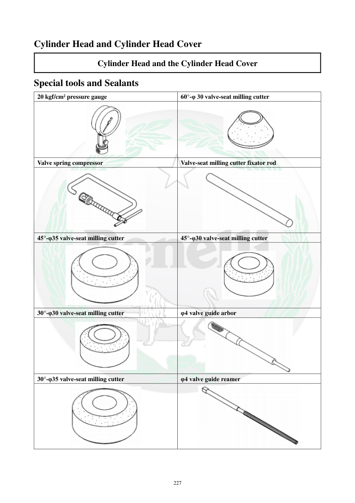

# Manual page 228

> Source: [page-0228.md](../source/page-0228.md)

## Page image / diagram

- [page-0228-img-01.png](../images/embedded/page-0228-img-01.png)

- [page-0228-img-02.png](../images/embedded/page-0228-img-02.png)

- [page-0228-img-03.png](../images/embedded/page-0228-img-03.png)

- [page-0228-img-04.png](../images/embedded/page-0228-img-04.png)

- [page-0228-img-05.png](../images/embedded/page-0228-img-05.png)

- [page-0228-img-06.png](../images/embedded/page-0228-img-06.png)

- [page-0228-img-07.png](../images/embedded/page-0228-img-07.png)

- [page-0228-img-08.png](../images/embedded/page-0228-img-08.png)

- [page-0228-img-09.png](../images/embedded/page-0228-img-09.png)

- [page-0228-img-10.png](../images/embedded/page-0228-img-10.png)

## Extracted text

# Source page 228

 
227 
Cylinder Head and Cylinder Head Cover 
Cylinder Head and the Cylinder Head Cover 
Special tools and Sealants 
20 kgf/cm² pressure gauge 
60°-φ 30 valve-seat milling cutter 
 
 
Valve spring compressor  
Valve-seat milling cutter fixator rod 
 
 
45°-φ35 valve-seat milling cutter  
45°-φ30 valve-seat milling cutter 
 
 
30°-φ30 valve-seat milling cutter 
φ4 valve guide arbor 
 
 
30°-φ35 valve-seat milling cutter 
φ4 valve guide reamer

## Persian notes

<!-- Persian translation/explanation will be added here. -->
